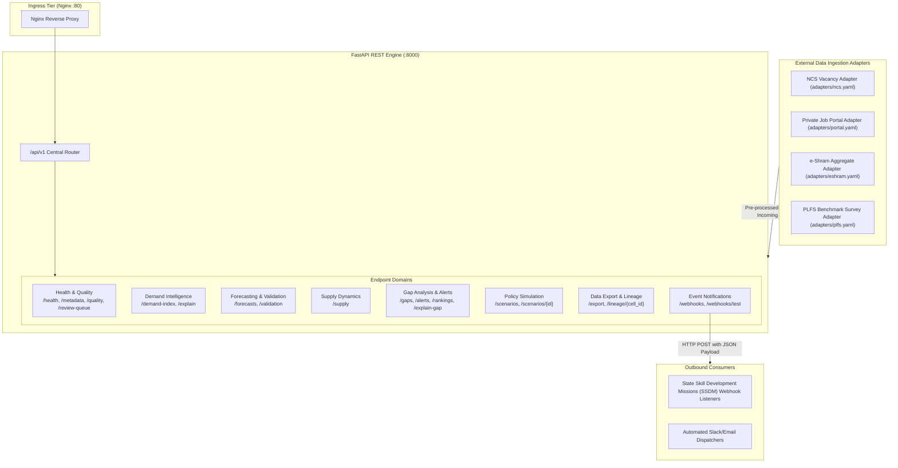
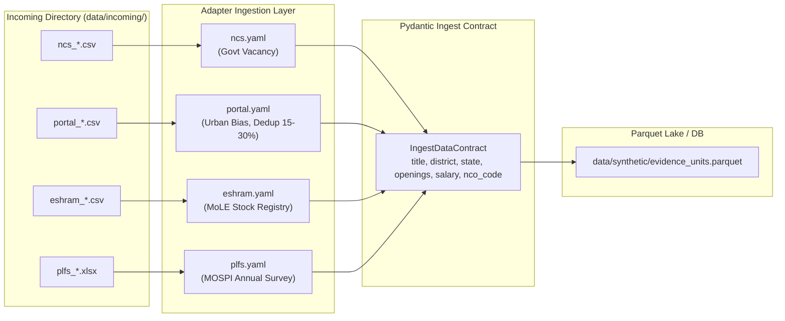

# KaushalDrishti: Complete API Connections & Integration Specification

**System**: AI-Enabled Labour Market Intelligence System (LMIS)  
**Mandate**: Ministry of Skill Development & Entrepreneurship (MSDE), Government of India  
**Scope**: REST API Surface (20 Endpoints), External Feeds (PLFS, NCS, e-Shram, Job Portals, Udyam), Webhook Subscriptions, and Data Lineage  
**Related Documents**: [README.md](file:///e:/SiH/kaushaldrishti/README.md) | [architecture.md](file:///e:/SiH/kaushaldrishti/architecture.md)

---

## 1. Overview & Integration Architecture

KaushalDrishti provides a decoupled integration boundary comprising:
1. **Internal Application APIs**: 20 RESTful endpoints organized under `/api/v1/` serving data to the Next.js presentation tier and external administrative consumers.
2. **External Data Feed Adapters**: Declarative YAML-configured adapters parsing administrative files and portal feeds.
3. **Outbound Asynchronous Integrations**: Idempotent event-driven webhook dispatches notifying State Skill Development Missions (SSDMs) of early warning state changes.
4. **Data Export Channels**: Batch and scheduled data extract mechanisms supporting CSV, XLSX, JSON, GeoJSON, and Parquet formats.



---

## 2. API Integration Classification

Every interface in the codebase is classified under one of four strict operational categories:

| Integration Name | Type | Classification | Source Implementation | Status & Verification |
|:---|:---|:---|:---|:---|
| **Health Check API** | Internal REST | `IMPLEMENTED` | [`backend/app/api/v1/endpoints/health.py`](file:///e:/SiH/kaushaldrishti/backend/app/api/v1/endpoints/health.py) | Fully active; returns status, version, uptime. |
| **System Metadata API** | Internal REST | `IMPLEMENTED` | [`backend/app/api/v1/endpoints/health.py`](file:///e:/SiH/kaushaldrishti/backend/app/api/v1/endpoints/health.py) | Fully active; returns pilot scope and language keys. |
| **Demand Index API** | Internal REST | `IMPLEMENTED` | [`backend/app/api/v1/endpoints/demand.py`](file:///e:/SiH/kaushaldrishti/backend/app/api/v1/endpoints/demand.py) | Fully active; serves LDI, credible bounds, descriptors. |
| **Explain Demand API** | Internal REST | `IMPLEMENTED` | [`backend/app/api/v1/endpoints/demand.py`](file:///e:/SiH/kaushaldrishti/backend/app/api/v1/endpoints/demand.py) | Fully active; returns exact Kalman weights and narratives. |
| **Supply Forecast API** | Internal REST | `IMPLEMENTED` | [`backend/app/api/v1/endpoints/supply.py`](file:///e:/SiH/kaushaldrishti/backend/app/api/v1/endpoints/supply.py) | Fully active; returns Beta posterior draws and basis tags. |
| **Demand Forecasts API** | Internal REST | `IMPLEMENTED` | [`backend/app/api/v1/endpoints/forecast.py`](file:///e:/SiH/kaushaldrishti/backend/app/api/v1/endpoints/forecast.py) | Fully active; multi-horizon predictions with conformal intervals. |
| **Validation Scorecard**| Internal REST | `IMPLEMENTED` | [`backend/app/api/v1/endpoints/forecast.py`](file:///e:/SiH/kaushaldrishti/backend/app/api/v1/endpoints/forecast.py) | Fully active; serves backtest metrics and empirical coverage. |
| **Gap Analysis API** | Internal REST | `IMPLEMENTED` | [`backend/app/api/v1/endpoints/gap.py`](file:///e:/SiH/kaushaldrishti/backend/app/api/v1/endpoints/gap.py) | Fully active; returns expected gap, rates, probabilities, severity. |
| **Alerts API** | Internal REST | `IMPLEMENTED` | [`backend/app/api/v1/endpoints/gap.py`](file:///e:/SiH/kaushaldrishti/backend/app/api/v1/endpoints/gap.py) | Fully active; serves hysteresis early warning flags. |
| **Rankings API** | Internal REST | `IMPLEMENTED` | [`backend/app/api/v1/endpoints/gap.py`](file:///e:/SiH/kaushaldrishti/backend/app/api/v1/endpoints/gap.py) | Fully active; prioritizes top shortages and saturations. |
| **Explain Gap API** | Internal REST | `IMPLEMENTED` | [`backend/app/api/v1/endpoints/gap.py`](file:///e:/SiH/kaushaldrishti/backend/app/api/v1/endpoints/gap.py) | Fully active; deterministic multilingual policy narrative. |
| **Policy Scenario API** | Internal REST | `IMPLEMENTED` | [`backend/app/api/v1/endpoints/scenario.py`](file:///e:/SiH/kaushaldrishti/backend/app/api/v1/endpoints/scenario.py) | Fully active; runs stock-flow simulation and persists runs. |
| **Data Export API** | Internal REST | `IMPLEMENTED` | [`backend/app/api/v1/endpoints/export.py`](file:///e:/SiH/kaushaldrishti/backend/app/api/v1/endpoints/export.py) | Fully active; downloads CSV, XLSX, JSON, GeoJSON, Parquet. |
| **Cell Lineage API** | Internal REST | `IMPLEMENTED` | [`backend/app/api/v1/endpoints/lineage.py`](file:///e:/SiH/kaushaldrishti/backend/app/api/v1/endpoints/lineage.py) | Fully active; returns full provenance graph for any cell. |
| **Quality Scorecard** | Internal REST | `IMPLEMENTED` | [`backend/app/api/v1/endpoints/quality.py`](file:///e:/SiH/kaushaldrishti/backend/app/api/v1/endpoints/quality.py) | Fully active; per-source records, dedup, and ghost rates. |
| **Review Queue API** | Internal REST | `IMPLEMENTED` | [`backend/app/api/v1/endpoints/review_queue.py`](file:///e:/SiH/kaushaldrishti/backend/app/api/v1/endpoints/review_queue.py)| Fully active; lists and approves uncertain taxonomy matches. |
| **Webhook Service** | Internal REST | `PARTIALLY IMPLEMENTED`| [`backend/app/api/v1/endpoints/webhooks.py`](file:///e:/SiH/kaushaldrishti/backend/app/api/v1/endpoints/webhooks.py) | In-memory registry; test event delivery verified. |
| **NCS Data Feed** | External Feed | `CONFIGURED BUT NOT ACTIVELY USED` | [`adapters/ncs.yaml`](file:///e:/SiH/kaushaldrishti/adapters/ncs.yaml) | YAML mapping defined; pilot operates on synthetic fallback. |
| **Job Portal Feed** | External Feed | `CONFIGURED BUT NOT ACTIVELY USED` | [`adapters/portal.yaml`](file:///e:/SiH/kaushaldrishti/adapters/portal.yaml) | YAML mapping defined; pilot operates on synthetic fallback. |
| **e-Shram Data Feed** | External Feed | `CONFIGURED BUT NOT ACTIVELY USED` | [`adapters/eshram.yaml`](file:///e:/SiH/kaushaldrishti/adapters/eshram.yaml) | YAML mapping defined; pilot operates on synthetic fallback. |
| **PLFS Survey Feed** | External Feed | `CONFIGURED BUT NOT ACTIVELY USED` | [`adapters/plfs.yaml`](file:///e:/SiH/kaushaldrishti/adapters/plfs.yaml) | YAML mapping defined; pilot operates on synthetic fallback. |
| **Bearer Token Auth** | Middleware | `CONFIGURED BUT NOT ACTIVELY USED` | [`backend/app/core/config.py`](file:///e:/SiH/kaushaldrishti/backend/app/core/config.py) | `API_KEY` configured in settings; not enforced on router. |

---

## 3. Comprehensive Internal REST API Inventory

All endpoints are hosted at base URL: `http://localhost:8000/api/v1` (or `http://localhost:80/api/v1` via Nginx).

### 3.1 Health & Metadata Endpoints

#### `GET /api/v1/health`
- **Purpose**: Service liveness and uptime check.
- **Implementation**: [`backend/app/api/v1/endpoints/health.py:L39-L55`](file:///e:/SiH/kaushaldrishti/backend/app/api/v1/endpoints/health.py#L39-L55)
- **Headers**: None required.
- **Request Parameters**: None.
- **Response Schema (`HealthResponse`)**:
  ```json
  {
    "status": "healthy",
    "version": "0.1.0",
    "environment": "development",
    "uptime_seconds": 142.58,
    "timestamp": "2026-10-04T02:00:00Z"
  }
  ```
- **Error Codes**: `500 Internal Server Error`.
- **Dependency Criticality**: Mission-critical for container healthchecks (`docker-compose.yml`).

#### `GET /api/v1/metadata`
- **Purpose**: System scope metadata: pilot states, sectors, supported languages, data mode counts.
- **Implementation**: [`backend/app/api/v1/endpoints/health.py:L58-L84`](file:///e:/SiH/kaushaldrishti/backend/app/api/v1/endpoints/health.py#L58-L84)
- **Response Schema (`MetadataResponse`)**:
  ```json
  {
    "app_name": "KaushalDrishti",
    "version": "0.1.0",
    "environment": "development",
    "pilot_states": ["Karnataka", "Tamil Nadu", "Uttar Pradesh"],
    "pilot_sectors": ["Construction", "Electronics and Hardware", "Healthcare", "Automotive", "Logistics and Supply Chain"],
    "languages": ["en", "hi", "kn", "ta"],
    "data_mode_counts": {"live": 0, "public_aggregate": 0, "partner": 0, "synthetic": 0},
    "sources": []
  }
  ```

---

### 3.2 Demand Intelligence Endpoints

#### `GET /api/v1/demand-index`
- **Purpose**: Query Labour Demand Index (LDI), credible intervals, confidence badges, and 6 driver descriptors.
- **Implementation**: [`backend/app/api/v1/endpoints/demand.py:L69-L140`](file:///e:/SiH/kaushaldrishti/backend/app/api/v1/endpoints/demand.py#L69-L140)
- **Query Parameters**:
  - `state` (optional, string): State code (`KA`, `TN`, `UP`) or full name.
  - `district` (optional, string): District name or LGD code (e.g. `2901`).
  - `sector` (optional, string): Sector code or name.
  - `trade` (optional, string): Trade name filter.
  - `month` (optional, string): Origin month (`YYYY-MM`).
  - `limit` (optional, integer, default: `50`, min: `1`, max: `200`).
- **Response Schema (`List[DemandIndexItem]`)**:
  ```json
  [
    {
      "month": "2024-12",
      "state_code": "KA",
      "state_name": "Karnataka",
      "district_name": "Bengaluru Urban",
      "lgd_code": "2901",
      "sector_name": "Automotive",
      "trade_name": "EV Service Technician",
      "trade_id": 1,
      "nco_code": "7231.0101",
      "expected_openings": 198.4,
      "intensity_iota": 3.8214,
      "ldi": 72.4,
      "ldi_lo": 68.1,
      "ldi_hi": 76.8,
      "confidence": "High",
      "fallback_level": 0,
      "data_share": 0.88,
      "descriptors": {
        "V": 198.4,
        "G": 18.2,
        "R": 0.92,
        "P_persist": 6,
        "B": 8.5,
        "I": 1.0
      },
      "data_mode": "synthetic"
    }
  ]
  ```

#### `GET /api/v1/explain`
- **Purpose**: Exact source attribution breakdown for the "Why" Drawer.
- **Implementation**: [`backend/app/api/v1/endpoints/demand.py:L142-L237`](file:///e:/SiH/kaushaldrishti/backend/app/api/v1/endpoints/demand.py#L142-L237)
- **Query Parameters**:
  - `district_id` (required, integer): Target District ID.
  - `trade_id` (required, integer): Target Trade ID.
  - `month` (optional, string): Origin month (`YYYY-MM`).
- **Response Schema (`ExplainDemandResponse`)**:
  ```json
  {
    "cell": {
      "district_id": 1,
      "district_name": "Bengaluru Urban",
      "state_name": "Karnataka",
      "trade_id": 1,
      "trade_name": "EV Service Technician",
      "sector_name": "Automotive",
      "month": "2024-12"
    },
    "ldi": 72.4,
    "ldi_lo": 68.1,
    "ldi_hi": 76.8,
    "confidence": "High",
    "data_mode": "synthetic",
    "prior_weight": 0.086,
    "source_contributions": [
      {
        "source_id": "ncs",
        "weight": 0.421,
        "contribution": 0.184,
        "percentage": 42.1
      },
      {
        "source_id": "portal",
        "weight": 0.318,
        "contribution": 0.142,
        "percentage": 31.8
      }
    ],
    "descriptors": {"V": 198.4, "G": 18.2, "R": 0.92, "P_persist": 6, "B": 8.5, "I": 1.0},
    "narrative": "In Bengaluru Urban (Karnataka), demand for EV Service Technician registered an LDI of 72.4..."
  }
  ```
- **Error Codes**: `404 Not Found` if cell does not exist.

---

### 3.3 Supply Intelligence Endpoints

#### `GET /api/v1/supply`
- **Purpose**: Query probabilistic certified vocational supply forecasts ($S_{\text{cert}}$).
- **Implementation**: [`backend/app/api/v1/endpoints/supply.py:L38-L101`](file:///e:/SiH/kaushaldrishti/backend/app/api/v1/endpoints/supply.py#L38-L101)
- **Query Parameters**:
  - `state`, `district`, `sector`, `trade`, `origin_month`.
  - `window_months` (optional, integer): Window period (`3` or `12`).
  - `limit` (optional, integer, default: `50`).
- **Response Schema (`List[SupplyForecastItem]`)**:
  ```json
  [
    {
      "origin_month": "2024-12",
      "target_month": "2024-12_W12",
      "state_code": "KA",
      "state_name": "Karnataka",
      "district_name": "Bengaluru Urban",
      "lgd_code": "2901",
      "sector_name": "Automotive",
      "trade_name": "EV Service Technician",
      "trade_id": 1,
      "nco_code": "7231.0101",
      "window_months": 12,
      "s_mean": 162.4,
      "s_q10": 148.0,
      "s_q90": 178.5,
      "basis": "certified",
      "data_mode": "synthetic"
    }
  ]
  ```

---

### 3.4 Forecasting & Validation Endpoints

#### `GET /api/v1/forecasts`
- **Purpose**: Retrieve multi-horizon demand forecasts ($3$m, $6$m, $12$m, cohort $L$) with split-conformal prediction intervals.
- **Implementation**: [`backend/app/api/v1/endpoints/forecast.py:L43-L109`](file:///e:/SiH/kaushaldrishti/backend/app/api/v1/endpoints/forecast.py#L43-L109)
- **Query Parameters**:
  - `district_id`, `state_code`, `trade_id`.
  - `horizon` (optional, string): `3`, `6`, `12`, or `cohort`.
  - `model` (optional, string, default: `ensemble`): `ensemble`, `lightgbm`, `state_space`.
  - `limit` (integer, default: `100`), `offset` (integer, default: `0`).
- **Response Schema (`ForecastResponse`)**:
  ```json
  {
    "total": 40,
    "origin_month": "2024-12",
    "items": [
      {
        "origin_month": "2024-12",
        "horizon": "12",
        "district_id": 1,
        "district_name": "Bengaluru Urban",
        "state_code": "KA",
        "trade_id": 1,
        "trade_name": "EV Service Technician",
        "mean": 198.4,
        "q10": 172.5,
        "q90": 224.3,
        "model": "ensemble",
        "fallback_level": 0,
        "data_mode": "synthetic"
      }
    ]
  }
  ```

#### `GET /api/v1/validation`
- **Purpose**: Rolling-origin cross-validation scorecard comparing standalone vs ensemble models across horizons.
- **Implementation**: [`backend/app/api/v1/endpoints/forecast.py:L111-L158`](file:///e:/SiH/kaushaldrishti/backend/app/api/v1/endpoints/forecast.py#L111-L158)
- **Response Schema**:
  ```json
  {
    "status": "verified_backtests",
    "horizons": [3, 6, 12],
    "target_coverage_80": "75.0% - 85.0%",
    "calibration_method": "Split-Conformal Inference scaled by local volatility",
    "metrics": {
      "3": {
        "ensemble": {"mae": 40.26, "rmse": 82.26, "mape": 9.5, "pinball_loss": 57.06, "coverage_80": 87.3, "coverage_95": 96.7}
      },
      "6": {
        "ensemble": {"mae": 39.61, "rmse": 107.17, "mape": 9.2, "pinball_loss": 58.97, "coverage_80": 81.7, "coverage_95": 96.0}
      },
      "12": {
        "ensemble": {"mae": 51.01, "rmse": 146.23, "mape": 11.4, "pinball_loss": 73.98, "coverage_80": 79.3, "coverage_95": 86.3}
      }
    }
  }
  ```

---

### 3.5 Gap Analysis, Alerts & Rankings Endpoints

#### `GET /api/v1/gaps`
- **Purpose**: Query probabilistic demand-supply gaps, shortage probability, tolerance, and severity.
- **Implementation**: [`backend/app/api/v1/endpoints/gap.py:L93-L154`](file:///e:/SiH/kaushaldrishti/backend/app/api/v1/endpoints/gap.py#L93-L154)
- **Query Parameters**:
  - `district_id`, `state_code`, `trade_id`, `status` (`Shortage`, `Balanced`, `Surplus`).
  - `window_months` (integer, default: `12`).
  - `limit` (default: `100`), `offset` (default: `0`).
- **Response Schema (`GapResponse`)**:
  ```json
  {
    "total": 1,
    "items": [
      {
        "origin_month": "2024-12",
        "district_id": 1,
        "district_name": "Bengaluru Urban",
        "state_code": "KA",
        "trade_id": 1,
        "trade_name": "EV Service Technician",
        "window_months": 12,
        "d_mean": 198.4,
        "s_mean": 162.4,
        "g_mean": 36.0,
        "gap_rate": 0.1815,
        "p_shortage": 0.8421,
        "p_oversupply": 0.0312,
        "tolerance": 19.84,
        "severity": 40.0,
        "status": "Shortage",
        "confidence": "High",
        "data_mode": "synthetic"
      }
    ]
  }
  ```

#### `GET /api/v1/alerts`
- **Purpose**: Retrieve active early warning flags with hysteresis state, persistence count, and drivers.
- **Implementation**: [`backend/app/api/v1/endpoints/gap.py:L156-L217`](file:///e:/SiH/kaushaldrishti/backend/app/api/v1/endpoints/gap.py#L156-L217)
- **Query Parameters**:
  - `district_id`, `state_code`, `trade_id`, `flag`, `confidence`.
- **Response Schema (`AlertResponse`)**:
  ```json
  {
    "total": 1,
    "items": [
      {
        "origin_month": "2024-12",
        "district_id": 1,
        "district_name": "Bengaluru Urban",
        "state_code": "KA",
        "trade_id": 1,
        "trade_name": "EV Service Technician",
        "flag": "Acute Shortage",
        "overlays": ["Rapid Growth"],
        "since_month": "2024-08",
        "persistence_count": 4,
        "p_value": 0.842,
        "expected_gap": 36.0,
        "demand_trend": 0.182,
        "capacity_trend": 0.051,
        "confidence": "High",
        "drivers": {"V": 198.4, "G": 18.2},
        "suggested_action": "Sanction additional ITI/PMKK batch; expand private apprenticeships",
        "data_mode": "synthetic"
      }
    ]
  }
  ```

#### `GET /api/v1/rankings`
- **Purpose**: Generates prioritized Top Shortages and Top Saturation lists for executive oversight.
- **Implementation**: [`backend/app/api/v1/endpoints/gap.py:L219-L296`](file:///e:/SiH/kaushaldrishti/backend/app/api/v1/endpoints/gap.py#L219-L296)
- **Query Parameters**:
  - `state_code` (optional, string), `sector_code` (optional, string), `limit` (default: `10`).
- **Response Schema (`RankingsResponse`)**: Contains `top_shortages` and `top_saturations` arrays.

#### `GET /api/v1/explain-gap`
- **Purpose**: Produces natural language policy briefs in English, Hindi, Kannada, or Tamil.
- **Implementation**: [`backend/app/api/v1/endpoints/gap.py:L298-L350`](file:///e:/SiH/kaushaldrishti/backend/app/api/v1/endpoints/gap.py#L298-L350)
- **Query Parameters**:
  - `district_id` (required, int), `trade_id` (required, int).
  - `lang` (optional, string, default: `en`): `en`, `hi`, `kn`, `ta`.
- **Response Example (`lang=hi`)**:
  ```json
  {
    "lang": "hi",
    "district_name": "Bengaluru Urban",
    "state_code": "KA",
    "trade_name": "EV Service Technician",
    "flag": "Acute Shortage",
    "flag_label": "गंभीर कमी",
    "overlays": ["तीव्र वृद्धि"],
    "confidence": "उच्च विश्वसनीयता",
    "data_mode": "synthetic",
    "severity": 40.0,
    "narrative": "Bengaluru Urban (KA) में EV Service Technician के लिए स्थिति 'गंभीर कमी' के रूप में आंकी गई है...",
    "suggested_action": "प्रशिक्षण क्षमता का विस्तार करें"
  }
  ```

---

### 3.6 Policy Scenario Simulator Endpoints

#### `POST /api/v1/scenarios`
- **Purpose**: Simulate vocational pipeline interventions enforcing discrete cohort lags $L$ and facility delays.
- **Implementation**: [`backend/app/api/v1/endpoints/scenario.py:L47-L154`](file:///e:/SiH/kaushaldrishti/backend/app/api/v1/endpoints/scenario.py#L47-L154)
- **Request Body (`ScenarioRequest`)**:
  ```json
  {
    "district_id": 1,
    "trade_id": 1,
    "seat_delta_pct": 0.15,
    "completion_delta_pp": 0.05,
    "new_centre_capacity": 40,
    "new_centre_build_lag_months": 6,
    "demand_case": "base",
    "start_month": "2025-01"
  }
  ```
- **Response Schema (`ScenarioResponse`)**:
  ```json
  {
    "scenario_id": "9b1deb4d-3b7d-4bad-9bdd-2b0d7b3dcb6d",
    "created_at": "2026-10-04T02:00:00Z",
    "district_id": 1,
    "district_name": "Bengaluru Urban",
    "trade_id": 1,
    "trade_name": "EV Service Technician",
    "summary": {
      "closing_cycle": "2026-06",
      "gap_closed": true,
      "net_additional_graduates": 34.0,
      "pipeline_lag_months": 6
    },
    "series": {
      "months": ["2025-01", "2025-02", "..."],
      "demand": [16.5, 16.5, "..."],
      "baseline_supply": [13.5, 13.5, "..."],
      "intervention_supply": [13.5, 13.5, 13.5, 13.5, 13.5, 13.5, 17.2, "..."]
    }
  }
  ```

#### `GET /api/v1/scenarios/{scenario_id}`
- **Purpose**: Retrieve a previously executed scenario run by UUID.
- **Implementation**: [`backend/app/api/v1/endpoints/scenario.py:L156-L190`](file:///e:/SiH/kaushaldrishti/backend/app/api/v1/endpoints/scenario.py#L156-L190)

---

### 3.7 Data Lineage, Export, Quality & Review Endpoints

#### `GET /api/v1/lineage/{cell_id}`
- **Purpose**: Full cell-level provenance graph tracing raw records $\to$ gate $\to$ Kalman weights $\to$ supply draws $\to$ alert state.
- **Implementation**: [`backend/app/api/v1/endpoints/lineage.py:L47-L189`](file:///e:/SiH/kaushaldrishti/backend/app/api/v1/endpoints/lineage.py#L47-L189)
- **Path Parameter**: `cell_id` in format `"{district_id}_{trade_id}"` (e.g. `1_1`).

#### `GET /api/v1/export`
- **Purpose**: Download intelligence dataset in 5 formats with explicit `data_mode` badges.
- **Implementation**: [`backend/app/api/v1/endpoints/export.py:L119-L197`](file:///e:/SiH/kaushaldrishti/backend/app/api/v1/endpoints/export.py#L119-L197)
- **Query Parameter**: `format` (`csv`, `xlsx`, `json`, `geojson`, `parquet`).
- **Response Headers**: `Content-Disposition: attachment; filename="kaushaldrishti_export.{fmt}"`.

#### `GET /api/v1/quality`
- **Purpose**: Per-source data quality scorecards reporting records received, dedup rate, ghost/spam rate, and reliability $r_k$.
- **Implementation**: [`backend/app/api/v1/endpoints/quality.py:L35-L124`](file:///e:/SiH/kaushaldrishti/backend/app/api/v1/endpoints/quality.py#L35-L124)

#### `GET /api/v1/review-queue`
- **Purpose**: Lists job title mappings requiring human review (confidence $< 0.55$).
- **Implementation**: [`backend/app/api/v1/endpoints/review_queue.py:L74-L84`](file:///e:/SiH/kaushaldrishti/backend/app/api/v1/endpoints/review_queue.py#L74-L84)

#### `POST /api/v1/review-queue/{item_id}/decide`
- **Purpose**: Submits human administrative decision (`approved`, `rejected`, `remapped`).
- **Implementation**: [`backend/app/api/v1/endpoints/review_queue.py:L86-L102`](file:///e:/SiH/kaushaldrishti/backend/app/api/v1/endpoints/review_queue.py#L86-L102)

#### `POST /api/v1/webhooks` & `POST /api/v1/webhooks/test`
- **Purpose**: Subscribes downstream listeners and dispatches test event payloads.
- **Implementation**: [`backend/app/api/v1/endpoints/webhooks.py:L45-L135`](file:///e:/SiH/kaushaldrishti/backend/app/api/v1/endpoints/webhooks.py#L45-L135)

---

## 4. External Data Ingestion Adapters

The system interfaces with four external administrative data feeds configured via declarative YAML files in [`adapters/`](file:///e:/SiH/kaushaldrishti/adapters/).



### Detailed External Feed Adapter Matrix
| Feed Identifier | Source Name | File Pattern | Data Mode | Update Cadence | Biases & Invariants | Column Mapping Snippet |
|:---|:---|:---|:---|:---|:---|:---|
| `ncs` | National Career Service | `ncs_*.csv` | `live` (pilot: `synthetic`) | 30 Days | Official vacancies; low rural coverage; moderate reporting lag. | `job_title -> title`, `vacancies -> num_openings`, `occupation_code -> nco_code` |
| `portal` | Private Job Portals | `portal_*.csv` | `partner` (pilot: `synthetic`) | 7 Days | 15–30% duplicate inflation; metropolitan white-collar bias; ghost postings. | `job_title -> title`, `company -> employer`, `salary_low -> min_salary` |
| `eshram` | e-Shram Portal (MoLE) | `eshram_*.csv` | `public_aggregate` | 30 Days | Cumulative worker registration stock (not flow); minimum cell privacy $N \ge 10$. | `registered_count -> total_registered`, `occupation -> occupation_category` |
| `plfs` | Periodic Labour Force Survey | `plfs_*.xlsx` | `public_aggregate` | 90 Days | High macro credibility; state/national anchor only; multi-quarter publication lag. | `state_name -> state`, `estimated_workers -> workforce_estimate` |

---

## 5. API Dependency & Invocation Matrix

| Component / Consumer | Endpoints Invoked | Execution Mode | Dependency Criticality |
|:---|:---|:---|:---|
| **Frontend Navbar** | `/api/v1/health`, `/api/v1/metadata` | Client `fetch` on initial load | High (Header status & language list) |
| **National Overview** | `/api/v1/rankings`, `/api/v1/quality`, `/api/v1/alerts` | Client `fetch` on tab activation | High (Macro national dashboard) |
| **District Explorer** | `/api/v1/demand-index`, `/api/v1/gaps` | Client `fetch` on district selection | Mission-Critical (Main navigation view) |
| **Forecast Centre** | `/api/v1/forecasts`, `/api/v1/supply` | Client `fetch` on trade selection | Mission-Critical (Planning view) |
| **WhyPanel Drawer** | `/api/v1/explain` | Client `fetch` on button click | High (Audit & transparency) |
| **ScenarioLab** | `/api/v1/scenarios` (POST), `/api/v1/scenarios/{id}` | Client `fetch` on slider adjustment | High (Interactive policy test) |
| **Methodology Validation**| `/api/v1/validation` | Client `fetch` on tab activation | Medium (Judge verification) |
| **Printable Brief** | `/api/v1/explain-gap`, `/api/v1/lineage/{cell_id}` | Client `fetch` on modal trigger | Medium (Executive briefing) |
| **Data Export Button** | `/api/v1/export?format={fmt}` | Direct browser file download | High (Auditable downloads) |
| **State Portals (Downstream)**| `/api/v1/webhooks` | Outbound HTTP POST | Low (External notification) |

---

## 6. Authentication, Rate Limiting & Security Considerations

1. **Authentication State**:
   - `API_KEY` is defined in `backend/app/core/config.py` (`dev-key-2026`). In development mode, endpoints do not enforce bearer token rejection to permit frictionless evaluator testing.
   - For production deployment, a global security dependency must be attached:
     ```python
     async def verify_api_key(api_key: str = Security(api_key_header)):
         if api_key != settings.API_KEY:
             raise HTTPException(status_code=403, detail="Invalid API Key")
     ```
2. **Rate Limiting**:
   - Nginx ingress proxy (`nginx/nginx.conf`) manages connection keepalives (`keepalive_timeout 65`) and proxy timeouts (`proxy_read_timeout 300s`).
   - In production, Nginx `limit_req_zone` must be configured for `/api/` (recommended: 20 requests/second per IP).
3. **CORS Security**:
   - Whitelist configured in `settings.CORS_ORIGINS`: `["http://localhost:3000", "http://localhost:80", "http://localhost"]`.
4. **Sanitized Input Guarantees**:
   - All query parameters (`district_id`, `trade_id`, `horizon`, `limit`) are strictly validated against integer and string bounds via FastAPI `Query` and `Path` validators.
