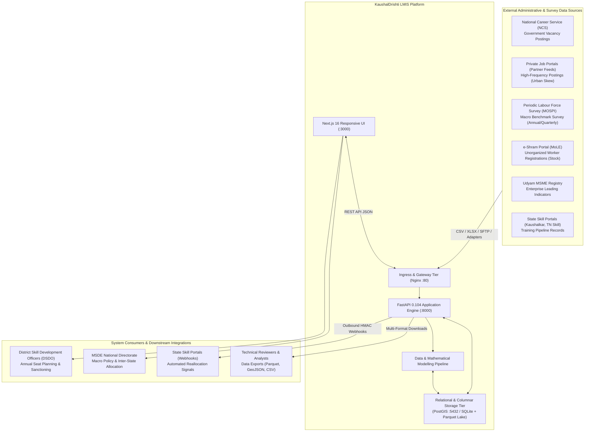
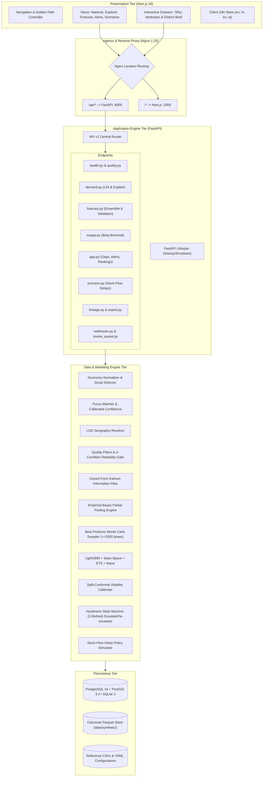
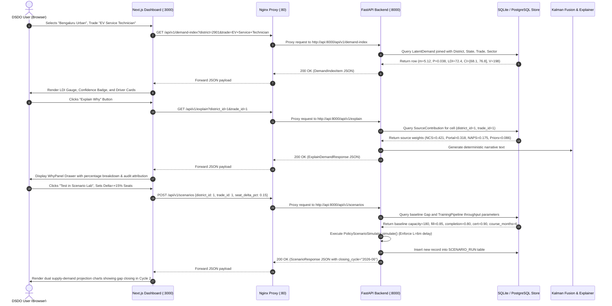
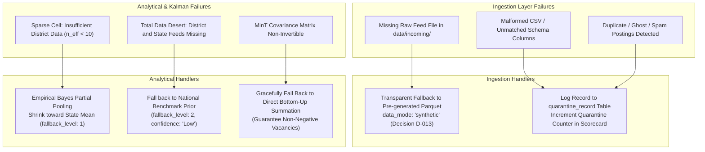
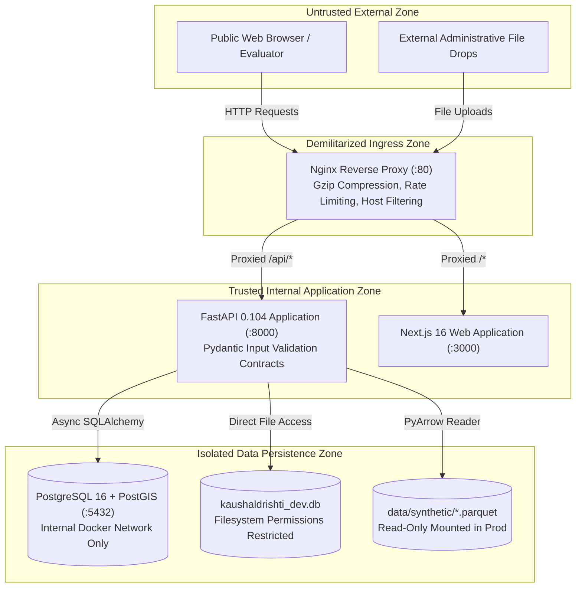
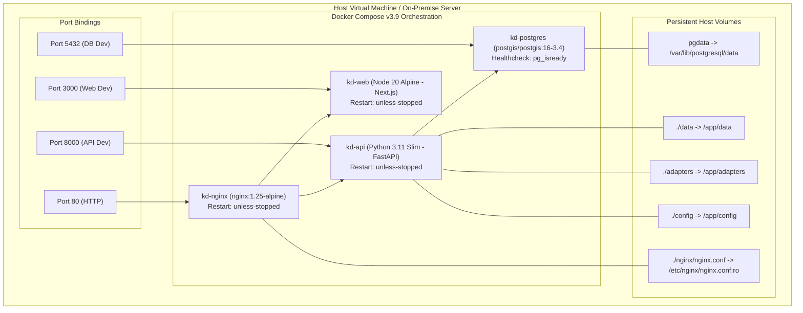

# KaushalDrishti: Authoritative Architecture Specification

**System**: AI-Enabled Labour Market Intelligence System (LMIS)  
**Mandate**: Ministry of Skill Development & Entrepreneurship (MSDE), Government of India  
**Scope**: 3 Pilot States (KA, TN, UP), 144 LGD Districts, 5 Priority Sectors, 40 Priority Trades, 48-Month Longitudinal Panel  
**Primary Reference Link**: [README.md](file:///e:/SiH/kaushaldrishti/README.md)

---

## 1. System Context & Operational Boundaries

KaushalDrishti operates within the institutional architecture of India's vocational skilling framework. Its primary operational consumer is the **District Skill Development Officer (DSDO)** and the **District Skill Committee (DSC)**, operating under state Skill Development Missions (SSDMs) and the national Ministry of Skill Development and Entrepreneurship (MSDE).

The system continuously fuses external public aggregates, government vacancy registries, private job portal postings, and enterprise registrations into a unified district-level intelligence signal.

---

## 2. High-Level Architecture

The platform is designed around strict separation between **transactional serving**, **batch analytical processing**, and **client presentation**.

---

## 3. Component Architecture & Deep Source Mapping

Below is the definitive component architecture mapping each functional domain to its underlying implementation, inputs, outputs, failure behaviors, and scaling characteristics.

### 3.1 Ingestion & Normalization Subsystem

#### Component: Ingest Loader
- **Purpose**: Adapter-driven ingestion of raw CSV/XLSX feeds from incoming drop directories with automated column mapping, schema validation, and quarantine routing.
- **Implementation**: [`backend/pipelines/ingest/loader.py`](file:///e:/SiH/kaushaldrishti/backend/pipelines/ingest/loader.py) (`IngestLoader`)
- **Inputs**: Incoming files in `data/incoming/` matching patterns in `adapters/*.yaml`.
- **Outputs**: Normalized in-memory records conforming to `IngestDataContract`; rejected records routed to `quarantine_records`.
- **Dependencies**: `PyYAML`, `pandas`, `pydantic`.
- **Consumers**: Evidence Unit Builder.
- **Failure Behavior**: Non-blocking; if a raw file is missing or corrupted, the loader logs a warning and transparently activates the synthetic Parquet fallback (`is_synthetic_fallback: True`), tagging records with `data_mode: synthetic` (Decision [D-013](file:///e:/SiH/kaushaldrishti/docs/DECISIONS.md)).
- **Scaling Characteristics**: $O(N)$ with respect to incoming row count.
- **Relevant Source Files**:
  - Loader: [`backend/pipelines/ingest/loader.py`](file:///e:/SiH/kaushaldrishti/backend/pipelines/ingest/loader.py#L56-L171)
  - Contract: [`backend/pipelines/ingest/loader.py`](file:///e:/SiH/kaushaldrishti/backend/pipelines/ingest/loader.py#L26-L54)
  - Adapters: [`adapters/ncs.yaml`](file:///e:/SiH/kaushaldrishti/adapters/ncs.yaml), [`adapters/portal.yaml`](file:///e:/SiH/kaushaldrishti/adapters/portal.yaml), [`adapters/eshram.yaml`](file:///e:/SiH/kaushaldrishti/adapters/eshram.yaml), [`adapters/plfs.yaml`](file:///e:/SiH/kaushaldrishti/adapters/plfs.yaml)

#### Component: Taxonomy Normalizer & Script Detector
- **Purpose**: Cleans raw job title text, detects dominant Indic scripts, and expands common industry abbreviations.
- **Implementation**: [`backend/pipelines/taxonomy/normalizer.py`](file:///e:/SiH/kaushaldrishti/backend/pipelines/taxonomy/normalizer.py)
- **Inputs**: Raw job title string (e.g., `"Sr. EV Tech / Battery Maint."` or `"ईवी तकनीशियन"`).
- **Outputs**: Normalized lowercase string, script identifier (`latin`, `devanagari`, `kannada`, `tamil`).
- **Dependencies**: `unicodedata`, `re`.
- **Consumers**: `TaxonomyMatcher`.
- **Failure Behavior**: Returns empty string or default `'latin'` script if unparseable; never throws exceptions.
- **Scaling Characteristics**: $O(L)$ where $L$ is string length; sub-millisecond execution.
- **Relevant Source Files**:
  - Normalizer: [`backend/pipelines/taxonomy/normalizer.py`](file:///e:/SiH/kaushaldrishti/backend/pipelines/taxonomy/normalizer.py#L63-L92)
  - Script Ranges: [`backend/pipelines/taxonomy/normalizer.py`](file:///e:/SiH/kaushaldrishti/backend/pipelines/taxonomy/normalizer.py#L12-L16)
  - Abbreviation Dictionary: [`backend/pipelines/taxonomy/normalizer.py`](file:///e:/SiH/kaushaldrishti/backend/pipelines/taxonomy/normalizer.py#L19-L40)

#### Component: Taxonomy Matcher
- **Purpose**: Maps free-text job titles and skills to official 40 benchmark trades, NCO-2015 codes, and NSDC QP codes with logistic sigmoid confidence calibration.
- **Implementation**: [`backend/pipelines/taxonomy/matcher.py`](file:///e:/SiH/kaushaldrishti/backend/pipelines/taxonomy/matcher.py) (`TaxonomyMatcher`)
- **Inputs**: Normalized title string and optional skills string.
- **Outputs**: Ranked list of tuples: `(nco_code, qp_code, trade_id, calibrated_confidence)`.
- **Dependencies**: `rapidfuzz.fuzz`, `data/reference/trades_master.csv`.
- **Consumers**: Ingestion pipeline, human-in-the-loop review queue (`/api/v1/review-queue`).
- **Failure Behavior**: If confidence $< 0.55$, matches are routed to the `mapping_review_queue` table for human administrative verification (Decision [D-010](file:///e:/SiH/kaushaldrishti/docs/DECISIONS.md)). Non-official NCO mappings retain `nco_verified: False` (Decision [D-006](file:///e:/SiH/kaushaldrishti/docs/DECISIONS.md)).
- **Scaling Characteristics**: $O(T \times \text{tokens})$ where $T=40$ benchmark trades.
- **Relevant Source Files**:
  - Matcher: [`backend/pipelines/taxonomy/matcher.py`](file:///e:/SiH/kaushaldrishti/backend/pipelines/taxonomy/matcher.py#L19-L128)
  - Sigmoid Calibration: [`backend/pipelines/taxonomy/matcher.py`](file:///e:/SiH/kaushaldrishti/backend/pipelines/taxonomy/matcher.py#L129-L142)

#### Component: Geography Resolver
- **Purpose**: Resolves unstructured location names to canonical Local Government Directory (LGD) district codes and state codes, handling historical aliases and transliterations.
- **Implementation**: [`backend/pipelines/taxonomy/geo.py`](file:///e:/SiH/kaushaldrishti/backend/pipelines/taxonomy/geo.py) (`GeoResolver`)
- **Inputs**: Location string (e.g., `"Bangalore"`, `"Madras"`, `"Allahabad"`, `"Hosur"`).
- **Outputs**: `(lgd_code, district_name, state_code, confidence)`.
- **Dependencies**: `rapidfuzz.fuzz`, `data/reference/lgd_districts.csv`.
- **Consumers**: Ingestion pipeline, district filtering endpoints.
- **Failure Behavior**: If fuzzy ratio $< 0.70$, returns `None`, flagging the record for manual quarantine.
- **Scaling Characteristics**: $O(D)$ where $D=144$ pilot districts.
- **Relevant Source Files**:
  - Resolver: [`backend/pipelines/taxonomy/geo.py`](file:///e:/SiH/kaushaldrishti/backend/pipelines/taxonomy/geo.py#L56-L121)
  - Alias Map: [`backend/pipelines/taxonomy/geo.py`](file:///e:/SiH/kaushaldrishti/backend/pipelines/taxonomy/geo.py#L16-L53)

---

### 3.2 Demand Intelligence & Kalman Fusion Subsystem

#### Component: Evidence Unit Builder
- **Purpose**: Converts raw posting counts into bias-corrected, variance-weighted log evidence units ($z, v$) calibrated to the anchor scale.
- **Implementation**: [`backend/pipelines/signals/evidence.py`](file:///e:/SiH/kaushaldrishti/backend/pipelines/signals/evidence.py) (`EvidenceUnitBuilder`)
- **Inputs**: Raw count $n_{\text{eff}}$, seasonal factor, coverage ratio, dynamic reliability factor $r_k$.
- **Outputs**: Evidence unit dictionary containing $\hat{o}$, $y = \ln(\hat{o} + 0.5)$, $\sigma^2$, calibrated observation $z$, and observation variance $v$.
- **Dependencies**: `math`, `numpy`.
- **Consumers**: Reliability Gate, Kalman Filter.
- **Failure Behavior**: Enforces minimum variance floor ($v \ge 10^{-6}$) and clips $r_k \in [0.1, 1.0]$.
- **Scaling Characteristics**: $O(1)$ per cell-source pair.
- **Relevant Source Files**:
  - Builder: [`backend/pipelines/signals/evidence.py`](file:///e:/SiH/kaushaldrishti/backend/pipelines/signals/evidence.py#L13-L69)

#### Component: Reliability Gate & Source Factor Evaluator
- **Purpose**: Evaluates 4 operational reliability criteria (Coverage, Freshness, Stability, Consensus Agreement) and dynamically updates source reliability $r_k$.
- **Implementation**: [`backend/pipelines/demand/gate.py`](file:///e:/SiH/kaushaldrishti/backend/pipelines/demand/gate.py) (`ReliabilityGate`)
- **Inputs**: Trailing 90-day effective volume, posting age, nominal update period, residual history, leave-one-out deviations.
- **Outputs**: Gate boolean flag (`gate_pass`), rejection reason (`gate_reason`), reliability factor $r_k$.
- **Dependencies**: `numpy`, [`config/gate.yaml`](file:///e:/SiH/kaushaldrishti/config/gate.yaml).
- **Consumers**: Kalman Information Filter.
- **Failure Behavior**: Gated-out sources are assigned zero weight ($w_k = 0$) and zero contribution without halting pipeline execution.
- **Scaling Characteristics**: $O(W)$ where $W \le 6$ months historical window.
- **Relevant Source Files**:
  - Gate: [`backend/pipelines/demand/gate.py`](file:///e:/SiH/kaushaldrishti/backend/pipelines/demand/gate.py#L13-L71)
  - Reliability Factor: [`backend/pipelines/demand/gate.py`](file:///e:/SiH/kaushaldrishti/backend/pipelines/demand/gate.py#L72-L90)

#### Component: Kalman Information Filter & Partial Pooling
- **Purpose**: Closed-form Bayesian state-space fusion of multi-source evidence, exact source attribution calculation, and Empirical Bayes shrinkage across districts.
- **Implementation**: [`backend/pipelines/demand/kalman.py`](file:///e:/SiH/kaushaldrishti/backend/pipelines/demand/kalman.py) (`KalmanFusion`)
- **Inputs**: Prior state $(m_{t-1}, P_{t-1}, b_{t-1})$, gated evidence observations $(z_k, v_k)$.
- **Outputs**: Posterior state $(m_t, P_t, b_t)$, exact source weights $w_k$, source contributions, pooled mean $m_{\text{pooled}}$, data share $\omega = 1 - \lambda$.
- **Dependencies**: `numpy`.
- **Consumers**: Demand Index Engine, Forecasters, "Why" Attribution endpoint (`/api/v1/explain`).
- **Failure Behavior**: If all sources fail the reliability gate, posterior gracefully defaults to prior projection ($m_t = m_{t|t-1}, P_t = P_{t|t-1}$) with zero new measurement update. Sparse cells fall back to state-level empirical pooling (Decision [D-015](file:///e:/SiH/kaushaldrishti/docs/DECISIONS.md)).
- **Scaling Characteristics**: $O(K)$ where $K$ is the number of active sources ($K \le 5$). Extremely fast: $< 5\mu\text{s}$ per cell.
- **Relevant Source Files**:
  - Filter: [`backend/pipelines/demand/kalman.py`](file:///e:/SiH/kaushaldrishti/backend/pipelines/demand/kalman.py#L13-L114)
  - Shrinkage: [`backend/pipelines/demand/kalman.py`](file:///e:/SiH/kaushaldrishti/backend/pipelines/demand/kalman.py#L116-L149)
  - Tau Estimation: [`backend/pipelines/demand/kalman.py`](file:///e:/SiH/kaushaldrishti/backend/pipelines/demand/kalman.py#L151-L162)

#### Component: Labour Demand Index (LDI) Engine
- **Purpose**: Computes population-standardized demand intensity ($\iota$), maps to normalized $LDI \in [0, 100]$ using frozen baseline empirical CDFs, calculates 6 driver descriptors ($V, G, R, P_{\text{persist}}, B, I$), and assigns confidence badges.
- **Implementation**: [`backend/pipelines/demand/index.py`](file:///e:/SiH/kaushaldrishti/backend/pipelines/demand/index.py) (`DemandIndexEngine`)
- **Inputs**: Posterior log-demand $m$, variance $P$, district working-age population, historical $m$ trajectory, source weights.
- **Outputs**: `(intensity_iota, ldi, ldi_lo, ldi_hi)`, driver dictionary, confidence badge (`High`, `Medium`, `Low`).
- **Dependencies**: `bisect`, `json`, [`config/baseline.json`](file:///e:/SiH/kaushaldrishti/config/baseline.json), [`config/confidence.yaml`](file:///e:/SiH/kaushaldrishti/config/confidence.yaml).
- **Consumers**: Demand endpoints (`/api/v1/demand-index`), Frontend National Overview and District Explorer.
- **Failure Behavior**: If trade baseline CDF is missing, falls back to parametric probit sigmoid approximation.
- **Scaling Characteristics**: $O(\log B)$ where $B$ is baseline sample size per trade ($B \approx 5,000$).
- **Relevant Source Files**:
  - LDI Calculation: [`backend/pipelines/demand/index.py`](file:///e:/SiH/kaushaldrishti/backend/pipelines/demand/index.py#L56-L107)
  - Descriptors: [`backend/pipelines/demand/index.py`](file:///e:/SiH/kaushaldrishti/backend/pipelines/demand/index.py#L109-L189)
  - Confidence Rules: [`backend/pipelines/demand/index.py`](file:///e:/SiH/kaushaldrishti/backend/pipelines/demand/index.py#L191-L221)

---

### 3.3 Supply Dynamics Subsystem

#### Component: Beta-Binomial Rate Model
- **Purpose**: Estimates fill rates ($E$), completion rates ($CR$), and certification rates ($Cert$) using conjugate Beta updates over state-level priors fitted via the method of moments.
- **Implementation**: [`backend/pipelines/supply/beta_models.py`](file:///e:/SiH/kaushaldrishti/backend/pipelines/supply/beta_models.py) (`BetaRateModel`)
- **Inputs**: Observed cohort trials and successes (sanctioned seats, enrolled, completed, certified).
- **Outputs**: Posterior parameters $(\alpha_{\text{post}}, \beta_{\text{post}})$, Beta random draws.
- **Dependencies**: `numpy`.
- **Consumers**: `SupplyDynamicsEngine`.
- **Failure Behavior**: Bounded mathematically to $[0, 1]$; handles zero trials gracefully.
- **Scaling Characteristics**: $O(1)$ conjugate update; $O(S)$ sampling time where $S \ge 2,000$.
- **Relevant Source Files**:
  - Method of Moments: [`backend/pipelines/supply/beta_models.py`](file:///e:/SiH/kaushaldrishti/backend/pipelines/supply/beta_models.py#L23-L47)
  - Conjugate Update: [`backend/pipelines/supply/beta_models.py`](file:///e:/SiH/kaushaldrishti/backend/pipelines/supply/beta_models.py#L48-L61)
  - Sampler: [`backend/pipelines/supply/beta_models.py`](file:///e:/SiH/kaushaldrishti/backend/pipelines/supply/beta_models.py#L62-L70)

#### Component: Supply Dynamics Engine
- **Purpose**: Generates probabilistic certified supply distributions ($S_{\text{cert}} = C \times E \times CR \times Cert$) over forward planning windows ($W=3$ and $W=12$).
- **Implementation**: [`backend/pipelines/supply/engine.py`](file:///e:/SiH/kaushaldrishti/backend/pipelines/supply/engine.py) (`SupplyDynamicsEngine`)
- **Inputs**: Training pipeline cohort records (`PipelineCohortInput`).
- **Outputs**: `(s_mean, s_q10, s_q90)`, basis label (`certified`, `capacity_based`, `certified_plus_other`).
- **Dependencies**: `numpy`, `dataclasses`.
- **Consumers**: Gap Engine, Supply API (`/api/v1/supply`).
- **Failure Behavior**: If unstarted cohorts have zero enrollment data, basis is strictly labelled `capacity_based` (Decision [D-021](file:///e:/SiH/kaushaldrishti/docs/DECISIONS.md)). Placement columns are structurally excluded from supply equations (Decision [D-019](file:///e:/SiH/kaushaldrishti/docs/DECISIONS.md)).
- **Scaling Characteristics**: $O(C \times S)$ where $C$ is cohort count and $S=2,000$ draws.
- **Relevant Source Files**:
  - Supply Pipeline: [`backend/pipelines/supply/engine.py`](file:///e:/SiH/kaushaldrishti/backend/pipelines/supply/engine.py#L34-L126)
  - Window Aggregation: [`backend/pipelines/supply/engine.py`](file:///e:/SiH/kaushaldrishti/backend/pipelines/supply/engine.py#L127-L166)

---

### 3.4 Forecasting & Calibration Subsystem

#### Component: Multi-Model Forecasters
- **Purpose**: Generates point and distribution forecasts across horizons ($h=3, 6, 12$ and cohort duration $L$).
- **Implementation**:
  - Seasonal Naive: [`backend/pipelines/forecast/baselines.py`](file:///e:/SiH/kaushaldrishti/backend/pipelines/forecast/baselines.py#L10-L43) (`SeasonalNaiveForecaster`)
  - Exponential Smoothing (ETS): [`backend/pipelines/forecast/baselines.py`](file:///e:/SiH/kaushaldrishti/backend/pipelines/forecast/baselines.py#L45-L98) (`SimpleETSForecaster`)
  - State-Space Kalman: [`backend/pipelines/forecast/state_space.py`](file:///e:/SiH/kaushaldrishti/backend/pipelines/forecast/state_space.py#L10-L97) (`StateSpaceForecaster`)
  - Global LightGBM: [`backend/pipelines/forecast/lightgbm_model.py`](file:///e:/SiH/kaushaldrishti/backend/pipelines/forecast/lightgbm_model.py#L20-L209) (`GlobalLightGBMForecaster`)
- **Inputs**: Historical panel features (lags, rolling stats, growth, cyclics, supply capacity) and current Kalman state $(m_t, b_t, P_t)$.
- **Outputs**: Horizon projections $\hat{V}_{t+h}$, standard errors $\sigma_h$.
- **Dependencies**: `lightgbm` (with fallback to `HistGradientBoostingRegressor`), `numpy`, `pandas`.
- **Consumers**: Forecast Ensemble Engine.
- **Failure Behavior**: If LightGBM fails to train due to sparse data, forecaster automatically falls back to State-Space and ETS.
- **Scaling Characteristics**: Inference latency $< 2\text{ms}$ per cell.

#### Component: Split-Conformal Calibrator
- **Purpose**: Calibrates prediction intervals against local horizon volatility, guaranteeing distribution-free finite-sample 80% and 95% coverage validity.
- **Implementation**: [`backend/pipelines/forecast/conformal.py`](file:///e:/SiH/kaushaldrishti/backend/pipelines/forecast/conformal.py) (`ConformalCalibrator`)
- **Inputs**: Holdout calibration predictions, actual observations, estimated local volatility $\sigma$.
- **Outputs**: Multipliers $q_{0.80}, q_{0.95}$, calibrated interval arrays `[q10, q90]`, effective standard error $\sigma_h = (q_{90} - q_{10}) / (2 \times 1.2816)$.
- **Dependencies**: `numpy`.
- **Consumers**: Forecast Ensemble, Gap Engine.
- **Failure Behavior**: If calibration holdout has $< 5$ points, defaults to Gaussian multipliers ($1.2816$ and $1.96$).
- **Scaling Characteristics**: $O(N \log N)$ during calibration; $O(1)$ during runtime inference.
- **Relevant Source Files**:
  - Calibrator: [`backend/pipelines/forecast/conformal.py`](file:///e:/SiH/kaushaldrishti/backend/pipelines/forecast/conformal.py#L11-L124)

#### Component: Ensemble Demand Forecaster & Hierarchical Reconciler
- **Purpose**: Combines standalone forecasters via temperature-scaled softmax weights that minimize multi-quantile pinball loss, and reconciles bottom-up across district $\to$ state $\to$ national hierarchies using MinT shrinkage.
- **Implementation**:
  - Ensemble: [`backend/pipelines/forecast/ensemble.py`](file:///e:/SiH/kaushaldrishti/backend/pipelines/forecast/ensemble.py) (`EnsembleDemandForecaster`)
  - Reconciler: [`backend/pipelines/forecast/reconciliation.py`](file:///e:/SiH/kaushaldrishti/backend/pipelines/forecast/reconciliation.py) (`HierarchicalReconciler`)
- **Inputs**: Predictions from all 4 sub-models, historical pinball losses, hierarchy mapping matrix $S$.
- **Outputs**: Ensemble forecast mean, total variance via the law of total variance, reconciled coherent forecasts.
- **Dependencies**: `numpy`, `scipy`.
- **Consumers**: Forecast API (`/api/v1/forecasts`), Gap Pipeline.
- **Failure Behavior**: If MinT matrix inversion fails due to singularity, seamlessly defaults to exact Bottom-Up summation.
- **Scaling Characteristics**: $O(M)$ for ensemble combination ($M=4$ models); $O(D^3)$ for MinT matrix inversion where $D \le 144$ (pre-computed in batch).
- **Relevant Source Files**:
  - Ensemble: [`backend/pipelines/forecast/ensemble.py`](file:///e:/SiH/kaushaldrishti/backend/pipelines/forecast/ensemble.py#L40-L171)
  - Pinball Loss: [`backend/pipelines/forecast/ensemble.py`](file:///e:/SiH/kaushaldrishti/backend/pipelines/forecast/ensemble.py#L16-L38)
  - MinT Reconciler: [`backend/pipelines/forecast/reconciliation.py`](file:///e:/SiH/kaushaldrishti/backend/pipelines/forecast/reconciliation.py#L11-L86)

---

### 3.5 Gap Analysis, Alerts & Policy Simulation Subsystem

#### Component: Gap & Severity Engine
- **Purpose**: Computes expected gap $G = D_W - S_W$, scaled tolerance $\tau = \max(0.10 E[D], 5.0)$, shortage probability $p_S$, oversupply probability $p_O$, and bounded severity score.
- **Implementation**: [`backend/pipelines/gap/engine.py`](file:///e:/SiH/kaushaldrishti/backend/pipelines/gap/engine.py) (`GapEngine`)
- **Inputs**: Forecast demand $(E[D], \sigma_D)$, certified supply $(E[S], \sigma_S)$, window $W$.
- **Outputs**: Gap distribution metrics: $g_{\text{mean}}, \text{gap\_rate}, \tau, p_S, p_O, p_B, \text{status}, \text{severity} \in [0, 100]$.
- **Dependencies**: `scipy.stats.norm`, `numpy`.
- **Consumers**: Gap endpoints (`/api/v1/gaps`), Alert State Machine.
- **Failure Behavior**: Guarantees probability simplex normalization ($p_S + p_O + p_B \equiv 1.0$) and clips severity to $[0, 100]$.
- **Scaling Characteristics**: $O(1)$ per cell.
- **Relevant Source Files**:
  - Engine: [`backend/pipelines/gap/engine.py`](file:///e:/SiH/kaushaldrishti/backend/pipelines/gap/engine.py#L12-L97)

#### Component: Hysteresis Alert Manager
- **Purpose**: Evaluates candidate early warning flags and enforces a 2-refresh persistence filter with an asymmetric de-escalation margin to eliminate decision chatter.
- **Implementation**: [`backend/pipelines/gap/flags.py`](file:///e:/SiH/kaushaldrishti/backend/pipelines/gap/flags.py) (`HysteresisAlertManager`)
- **Inputs**: Signal input tuple $(p_S, p_O, \text{gap\_rate}, \text{growth}, \text{confidence})$, current active flag, persistence count.
- **Outputs**: `(new_flag, new_persistence_count, overlays, transition_reason)`.
- **Dependencies**: [`config/flags.yaml`](file:///e:/SiH/kaushaldrishti/config/flags.yaml).
- **Consumers**: Alert endpoints (`/api/v1/alerts`), Alert History audit log.
- **Failure Behavior**: Retains current operational flag if state conditions oscillate or de-escalation margin is not met. Mutual exclusivity structurally prohibits simultaneous shortage and saturation flags (Decision [D-030](file:///e:/SiH/kaushaldrishti/docs/DECISIONS.md)).
- **Scaling Characteristics**: $O(1)$ state machine evaluation.
- **Relevant Source Files**:
  - Hysteresis Manager: [`backend/pipelines/gap/flags.py`](file:///e:/SiH/kaushaldrishti/backend/pipelines/gap/flags.py#L25-L126)

#### Component: Multilingual Narrative Explainer
- **Purpose**: Generates deterministic natural language policy briefs in English, Hindi, Kannada, and Tamil without runtime LLM dependencies.
- **Implementation**: [`backend/pipelines/gap/explain.py`](file:///e:/SiH/kaushaldrishti/backend/pipelines/gap/explain.py) (`MultilingualExplainer`)
- **Inputs**: Cell identifiers, early warning flag, gap summary, driver descriptors, language code (`en`, `hi`, `kn`, `ta`).
- **Outputs**: Structured localized dictionary containing translated narrative, flag labels, overlay tags, and advisory action.
- **Dependencies**: `pandas`, [`data/reference/glossary.csv`](file:///e:/SiH/kaushaldrishti/data/reference/glossary.csv).
- **Consumers**: Gap explainability endpoint (`/api/v1/explain-gap`), Frontend WhyPanel.
- **Failure Behavior**: If a translation key is missing for a target language, falls back strictly to the English term (Decision [D-031](file:///e:/SiH/kaushaldrishti/docs/DECISIONS.md)).
- **Scaling Characteristics**: $O(1)$ string templating.
- **Relevant Source Files**:
  - Explainer: [`backend/pipelines/gap/explain.py`](file:///e:/SiH/kaushaldrishti/backend/pipelines/gap/explain.py#L14-L160)

#### Component: Stock-Flow Policy Simulator
- **Purpose**: Simulates forward multi-cycle vocational pipeline interventions enforcing discrete cohort training delays $L$ and facility commissioning lags $L_{\text{build}}$.
- **Implementation**: [`backend/pipelines/scenario/simulator.py`](file:///e:/SiH/kaushaldrishti/backend/pipelines/scenario/simulator.py) (`PolicyScenarioSimulator`)
- **Inputs**: Base demand, volatility, baseline capacity, rates $(E, CR, Cert)$, course duration $L$, policy adjustments ($\Delta \text{seat}\%$, $\Delta CR$, new centre capacity, build lag).
- **Outputs**: Monthly simulation paths (Months 1–24), identification of exact gap closure cycle, net additional certified graduates.
- **Dependencies**: `numpy`, `math`.
- **Consumers**: Scenario API (`/api/v1/scenarios`), Frontend ScenarioLab.
- **Failure Behavior**: Bounds inputs strictly ($\Delta \text{seat} \in [-50\%, +50\%]$, $CR \le 0.99$); prevents unrealistic instantaneous supply creation.
- **Scaling Characteristics**: $O(T)$ where $T=24$ simulation months ($< 1\text{ms}$ execution).
- **Relevant Source Files**:
  - Simulator: [`backend/pipelines/scenario/simulator.py`](file:///e:/SiH/kaushaldrishti/backend/pipelines/scenario/simulator.py#L14-L164)

---

## 4. Database Architecture & Entity-Relationship Model

The canonical schema is implemented using SQLAlchemy 2.0 ORM (`backend/app/db/models.py`), supporting both PostgreSQL with PostGIS extension (production) and SQLite via `aiosqlite` (development and fast testing).

```mermaid
erDiagram
    STATE ||--o{ DISTRICT : "contains"
    SECTOR ||--o{ TRADE : "contains"
    SOURCE ||--o{ RAW_RECORD : "originates"
    SOURCE ||--o{ EVIDENCE_UNIT : "supplies"
    SOURCE ||--o{ SOURCE_CONTRIBUTION : "attributed_in"
    SOURCE ||--o{ DATA_QUALITY_SCORECARD : "evaluated_in"
    
    DISTRICT ||--o{ EVIDENCE_UNIT : "evaluates"
    TRADE ||--o{ EVIDENCE_UNIT : "evaluates"
    
    DISTRICT ||--o{ LATENT_DEMAND : "models"
    TRADE ||--o{ LATENT_DEMAND : "models"
    
    DISTRICT ||--o{ SOURCE_CONTRIBUTION : "measures"
    TRADE ||--o{ SOURCE_CONTRIBUTION : "measures"
    
    DISTRICT ||--o{ TRAINING_PIPELINE : "trains"
    TRADE ||--o{ TRAINING_PIPELINE : "trains"
    
    DISTRICT ||--o{ SUPPLY_FORECAST : "projects"
    TRADE ||--o{ SUPPLY_FORECAST : "projects"
    
    DISTRICT ||--o{ DEMAND_FORECAST : "forecasts"
    TRADE ||--o{ DEMAND_FORECAST : "forecasts"
    
    DISTRICT ||--o{ GAP : "computes"
    TRADE ||--o{ GAP : "computes"
    
    DISTRICT ||--o{ ALERT : "triggers"
    TRADE ||--o{ ALERT : "triggers"
    
    DISTRICT ||--o{ ALERT_HISTORY : "logs"
    TRADE ||--o{ ALERT_HISTORY : "logs"
    
    DISTRICT ||--o{ SCENARIO_RUN : "simulates"
    TRADE ||--o{ SCENARIO_RUN : "simulates"

    STATE {
        int id PK
        string code UK "KA, TN, UP"
        string name UK "Karnataka, Tamil Nadu, Uttar Pradesh"
    }

    DISTRICT {
        int id PK
        string lgd_code UK "LGD Code (e.g. 2901)"
        int state_id FK
        string name "District Name"
        json name_variants "Aliases & Transliterations"
        int population_working_age "Working Age Population"
        string urban_rural_aspirational "urban/rural/aspirational"
        json geometry_json "GeoJSON Polygon/Centroid"
    }

    SECTOR {
        int id PK
        string code UK "AUTO, HEALTH, ELECT, CONST, LOGIS"
        string name UK "Sector Name"
    }

    TRADE {
        int id PK
        int sector_id FK
        string name "Trade Name"
        string nco_code "NCO-2015 8-digit Code"
        boolean nco_verified "Verified vs Indicative"
        string qp_code "NSDC Qualification Pack Code"
        int nsqf_level "NSQF Level (e.g. 3, 4, 5)"
        int course_months "Duration L (e.g. 6, 12)"
        json aliases "Synonyms & Multi-token Patterns"
        json title_patterns "Regex Matching Patterns"
    }

    SOURCE {
        string id PK "ncs, portal, plfs, eshram, udyam"
        string name "Display Name"
        int nominal_update_days "Freshness Expectation"
        string independence_group "Corroboration Category"
        string licence "Open Data / Partner Agreement"
        string access_mode "live, public_aggregate, partner"
    }

    RAW_RECORD {
        int id PK
        string source_id FK
        datetime pulled_at
        string schema_version
        string payload_hash "SHA-256 Hash"
        string data_mode "live, partner, synthetic"
        json payload_json
    }

    EVIDENCE_UNIT {
        int id PK
        string month "YYYY-MM"
        int district_id FK
        int trade_id FK
        string source_id FK
        float n_eff "Effective Volume"
        float o_hat "Corrected Volume"
        float y_log "Log Transformed"
        float sigma2 "Estimated Variance"
        float z "Anchor Calibrated"
        float v "Observation Variance"
        boolean gate_pass "Reliability Status"
        string gate_reason "Failure Explanation"
        float r_k "Dynamic Reliability"
        string data_mode "synthetic / live"
    }

    LATENT_DEMAND {
        int id PK
        string month "YYYY-MM"
        int district_id FK
        int trade_id FK
        float m "Posterior Log-Demand Mean"
        float P "Posterior Variance"
        float slope "Drift b_t"
        float data_share "Local Data Share omega"
        int fallback_level "0=Dist, 1=State, 2=Nat"
        int n_gated_sources
        float intensity_iota "Standardized Intensity"
        float ldi "LDI (0-100)"
        float ldi_lo "80% CI Lower"
        float ldi_hi "80% CI Upper"
        string confidence "High, Medium, Low"
        float V "Expected Openings"
        float G "3m Annualized Growth %"
        float R "Recency Index"
        int P_persist "Growth Persistence Months"
        float B "Employer Breadth"
        float I "Corroboration Score"
        string data_mode "synthetic / live"
    }

    SOURCE_CONTRIBUTION {
        int id PK
        string month "YYYY-MM"
        int district_id FK
        int trade_id FK
        string source_id FK
        float weight "Kalman Information Weight"
        float contribution "Contribution to Delta m"
    }

    TRAINING_PIPELINE {
        int id PK
        string month "YYYY-MM"
        int district_id FK
        int trade_id FK
        string centre_id "Training Facility ID"
        int capacity "Sanctioned Physical Capacity"
        int allocated_seats "Budgeted Target Seats"
        int enrolled "Active Trainees"
        int completed "Completed Coursework"
        int certified "Passed Final Assessment"
        int placed "Placements (Excluded from Supply)"
        string data_mode "synthetic / live"
    }

    SUPPLY_FORECAST {
        int id PK
        string origin_month "YYYY-MM"
        string target_month "YYYY-MM"
        int district_id FK
        int trade_id FK
        int window_months "3 or 12"
        float s_mean "Expected Certified Supply"
        float s_q10 "10th Percentile"
        float s_q90 "90th Percentile"
        string basis "certified / capacity_based"
        string data_mode "synthetic / live"
    }

    DEMAND_FORECAST {
        int id PK
        string origin_month "YYYY-MM"
        string horizon "3, 6, 12, cohort"
        int district_id FK
        int trade_id FK
        float mean "Forecast Point Estimate"
        float q10 "Conformal 10th Percentile"
        float q90 "Conformal 90th Percentile"
        string model "ensemble, lightgbm, state_space"
        int fallback_level
        string data_mode "synthetic / live"
    }

    GAP {
        int id PK
        string origin_month "YYYY-MM"
        string horizon "12 or 3"
        int district_id FK
        int trade_id FK
        int window_months "12 or 3"
        float d_mean "Forecast Demand"
        float s_mean "Projected Supply"
        float g_mean "Expected Gap (D - S)"
        float gap_rate "Gap / Demand"
        float p_shortage "P(G > tau)"
        float p_oversupply "P(G < -tau)"
        float tolerance "Dynamic Tolerance tau"
        float severity "Severity Score (0-100)"
        string status "Shortage, Balanced, Surplus"
        string confidence "High, Medium, Low"
        string data_mode "synthetic / live"
    }

    ALERT {
        int id PK
        string origin_month "YYYY-MM"
        int district_id FK
        int trade_id FK
        string flag "Acute Shortage, Saturated, etc."
        json overlays "Rapid Growth, Volatile"
        string since_month "Onset Cycle"
        int persistence_count "Consecutive Refreshes"
        float p_value "Active Probability"
        float expected_gap "Expected Deficit/Surplus"
        float demand_trend "Growth Rate"
        float capacity_trend "Training Expansion Rate"
        string confidence "High, Medium, Low"
        json drivers_json "Descriptor Summary"
        string suggested_action "Policy Recommendation"
        string data_mode "synthetic / live"
    }

    ALERT_HISTORY {
        int id PK
        int district_id FK
        int trade_id FK
        string month "YYYY-MM"
        string previous_flag
        string new_flag
        string reason "Transition Justification"
        datetime changed_at
    }

    SCENARIO_RUN {
        string id PK "UUID"
        int district_id FK
        int trade_id FK
        float seat_delta_pct "Adjustment %"
        float completion_delta_pp "Shift pp"
        int new_centre_capacity "New Facility Seats"
        string demand_case "base, high, low"
        json results_json "Complete Simulation Paths"
        datetime created_at
    }
```

---

## 5. Request Lifecycle & Primary Execution Sequence

The sequence below illustrates the end-to-end request lifecycle when a District Skill Development Officer opens the Forecast Centre and inspects the EV Service Technician trade in Bengaluru Urban.

---

## 6. Failure Modes, Fallbacks & Error Propagation

The platform adheres to strict non-blocking fault tolerance principles. Failures at lower data ingest or modeling layers must never crash the operational user interface.

### Detailed Failure Handling Table
| Subsystem | Potential Failure Mode | Root Cause / Trigger | Technical Fallback Implemented | User-Facing Indication |
|:---|:---|:---|:---|:---|
| **Ingest** | Missing file in `data/incoming/` | Feed delayed or unmounted. | `IngestLoader._fallback_to_synthetic()` loads pre-computed synthetic Parquet. | Cell displays immutable badge: `Synthetic (Demonstration)`. |
| **Taxonomy** | Unknown job title pattern | New slang, novel industry jargon. | Title similarity drops below `0.55`; routed to `mapping_review_queue`. | Item appears in administrative Review Queue dashboard. |
| **Geography**| Unmatched district name | Unregistered colloquial alias. | Fuzzy Levenshtein score $< 0.70$; returns `None`. | Record rejected to quarantine log; pipeline proceeds. |
| **Gate** | Stale or noisy data feed | Age $> 2 \times$ nominal or Consensus Deviation $> 3.0$. | Reliability Gate sets `gate_pass = False`, weight $w_k = 0.0$. | Why Panel displays source status: `Gated Out (Consensus Disagreement)`. |
| **Demand** | Small district sample ($n_{\text{eff}} < 10$) | Rural / aspirational district. | Empirical Bayes partial pooling borrows strength from state mean. | Metric badge: `fallback_level: 1`, data share $\omega < 65\%$. |
| **Forecasting**| High horizon volatility | Macroeconomic trade disruption. | Split-conformal calibration expands prediction interval width. | Uncertainty interval bands widen symmetrically on charts. |
| **Forecasting**| MinT matrix singularity | Collinear district time-series. | Singular value decomposition exception caught; switches to Bottom-Up. | Forecast values remain numerically valid and non-negative. |
| **Scenario** | Erroneous policy parameters | User inputs negative capacity or completion $> 100\%$. | Simulator clips parameters to valid ranges ($\Delta \text{seat} \in [-50\%, +50\%]$). | User interface displays slider bounding validation warning. |

---

## 7. Security Architecture & Trust Boundaries

The system enforces clear trust boundaries between the external internet, the ingress proxy, the application runtime, and the underlying storage engines.

### Trust Boundary Rules
1. **Ingress Boundary**: Only ports `80` (HTTP) and `443` (HTTPS in production) are exposed to the external network. The database port (`5432`) and backend port (`8000`) are bound to internal Docker network interfaces only.
2. **Input Validation Boundary**: All HTTP payloads pass through Pydantic v2 data models with explicit field coercion and boundary validation, neutralizing SQL injection, XSS payloads, and malformed numeric parameters.
3. **Administrative Override Boundary**: While standard queries are read-only, administrative actions (review queue decisions, scenario persistence) require authenticated API requests and write immutable audit records to `audit_log`.

---

## 8. Deployment & Infrastructure Architecture

The standard production deployment is fully containerized using Docker Compose (`docker-compose.yml`):

---

## 9. Architectural Decision Records (ADR Summary)

The system implementation reflects 38 explicit Architectural Decision Records (ADRs) documented in [`docs/DECISIONS.md`](file:///e:/SiH/kaushaldrishti/docs/DECISIONS.md). The critical foundational decisions include:

| ADR ID | Decision Title | Architectural Choice | Justification & Operational Value |
|:---|:---|:---|:---|
| **D-001** | Test Database Engine | SQLite fallback for testing and development. | Avoids hard PostgreSQL requirement for local evaluation and GitHub Actions CI. |
| **D-002** | Ingress Gateway | Nginx reverse proxy on port 80. | Single port entry point; routes `/api/` to FastAPI and `/` to Next.js. |
| **D-006** | Official Taxonomy Compliance | Non-official NCO mappings marked `verified: false`. | Strictly enforces Rule 7: Never present indicative mappings as official standards. |
| **D-007** | Deterministic Generation | Synthetic generator seed pinned to `42`. | Complete reproducibility for rolling-origin backtests and evaluator golden paths. |
| **D-010** | Taxonomy Review Cutoff | Cutoff threshold set at `0.55`. | Ambiguous job title matches enter the human-in-the-loop review queue. |
| **D-011** | Geography Resolution | Exact match + Levenshtein distance. | Avoids token substring false positives (e.g., 'Prayagraj' vs 'Agra'). |
| **D-014** | Demand Fusion Math | Information-form Kalman filter formulation. | Closed-form Bayesian updates; zero MCMC lag; exact percentage attribution weights. |
| **D-015** | Cross-District Shrinkage | Empirical Bayes partial pooling. | Shrinks sparse district estimates toward state mean ($\omega = 1 - \lambda$). |
| **D-016** | LDI Reference Baseline | Frozen 24-month baseline empirical CDF. | LDI measures absolute progress over time rather than floating relative ranks. |
| **D-019** | Supply Pipeline Definition | Structural exclusion of placement data. | Prohibits circular reasoning and false capacity suppression. |
| **D-023** | Conformal Uncertainty | Horizon-dependent volatility scaling. | Guarantees empirical 80% coverage within $[75\%, 85\%]$ acceptance bounds. |
| **D-027** | Gap Tolerance | Dynamic tolerance $\tau = \max(0.10 E[D], 5.0)$. | Scales tolerance with volume while enforcing a 5-seat resolution floor. |
| **D-028** | Anti-Flicker Alerts | 2-refresh hysteresis state machine. | Eliminates alarm chatter; requires 2 consecutive cycles to escalate. |
| **D-029** | Alert De-escalation | Probability margin $(\text{threshold} - 0.10)$. | Stabilizes administrative planning; prevents premature de-escalation. |
| **D-030** | State Mutual Exclusivity | Shortage and Saturation mutually exclusive. | Structurally prohibits contradictory planning recommendations. |
| **D-031** | Multilingual Explanations | Deterministic templated narratives. | Multilingual generation via pre-translated glossaries; zero runtime LLM drift. |
| **D-032** | Stock-Flow Simulation | Enforce cohort training delay $L$ and build lag. | Prohibits unrealistic instantaneous supply creation. |
| **D-036** | Accessibility Fallback | Low-bandwidth semantic HTML fallback tables. | Ensures accessibility in remote district offices with slow connectivity. |

---

## 10. Architectural Weaknesses & Technical Debt Audit

To maintain complete engineering honesty, the following architectural weaknesses and technical debt items are explicitly acknowledged:

1. **Unenforced API Authentication Middleware**:
   - *Current State*: `API_KEY` is configured in `app/core/config.py` (`dev-key-2026`) and passed in `docker-compose.yml`, but individual FastAPI endpoints do not currently enforce a `Depends(verify_api_key)` dependency.
   - *Technical Debt*: Endpoints are publicly accessible in development mode.
   - *Remediation Path*: Implement a global FastAPI security dependency enforcing Bearer token authentication in production.
2. **In-Memory Webhook Registry**:
   - *Current State*: `backend/app/api/v1/endpoints/webhooks.py` stores webhook listeners in a module-level Python dictionary (`_WEBHOOK_REGISTRY`).
   - *Technical Debt*: Webhook registrations are lost upon application process restart.
   - *Remediation Path*: Create a dedicated `webhook_subscription` table in the database schema.
3. **Stubbed Refresh Orchestrator**:
   - *Current State*: `backend/pipelines/refresh.py` contains print stubs rather than directly executing the pipeline runner classes.
   - *Technical Debt*: Running `make refresh` does not execute the full multi-stage pipeline.
   - *Remediation Path*: Wire `run_demand_pipeline()`, `run_supply_pipeline()`, and `run_forecast_pipeline()` directly into `refresh.py`.
4. **Hardcoded Pilot Geographic Assumptions**:
   - *Current State*: LGD district mappings, state codes, and location aliases are hardcoded for Karnataka, Tamil Nadu, and Uttar Pradesh (53 alias mappings in `pipelines/taxonomy/geo.py`).
   - *Technical Debt*: Adding a new state currently requires code modifications.
   - *Remediation Path*: Adopt configuration-driven YAML state manifests as outlined in [future-state-expansion.md](file:///e:/SiH/kaushaldrishti/future-state-expansion.md).
