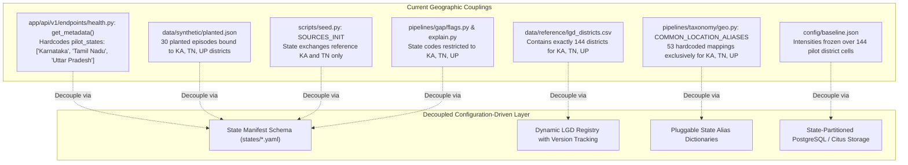
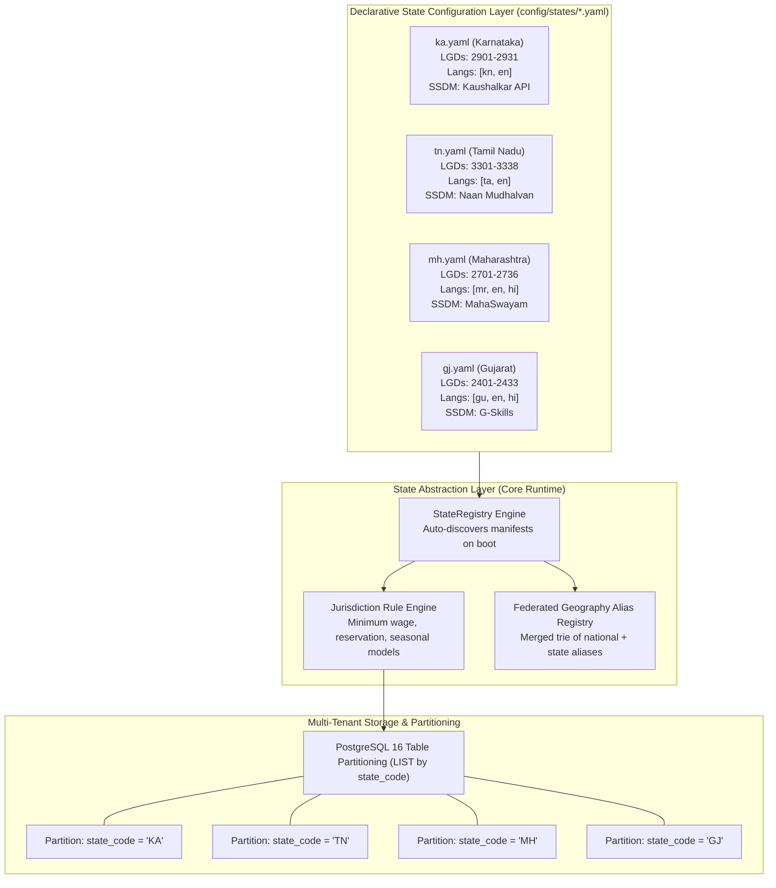
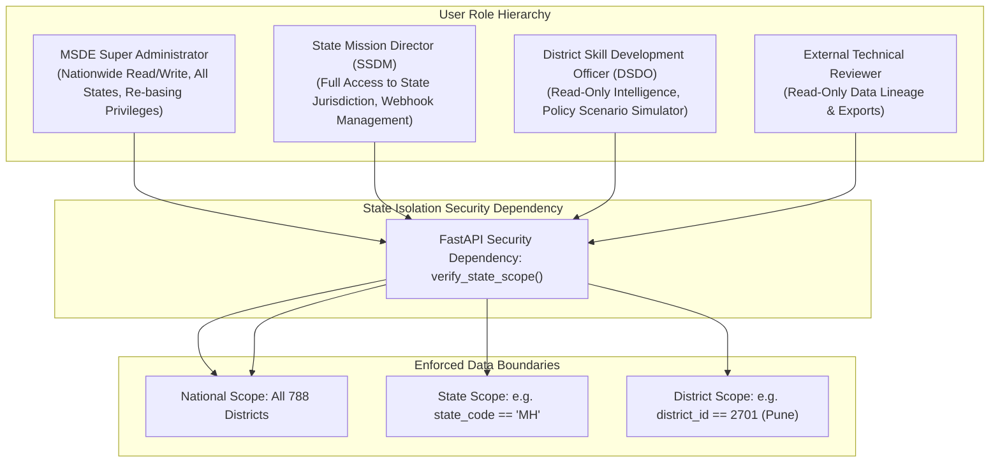
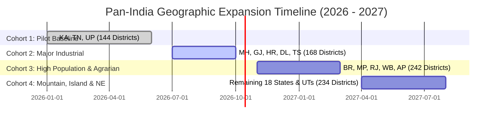

# KaushalDrishti: Multi-State Geographic Expansion Architecture

**System**: AI-Enabled Labour Market Intelligence System (LMIS)  
**Mandate**: Ministry of Skill Development & Entrepreneurship (MSDE), Government of India  
**Scope**: Transition from 3 Pilot States (144 Districts) to Pan-India Coverage (28 States, 8 UTs, 788+ LGD Districts)  
**Related Documents**: [README.md](file:///e:/SiH/kaushaldrishti/README.md) | [architecture.md](file:///e:/SiH/kaushaldrishti/architecture.md) | [language-support.md](file:///e:/SiH/kaushaldrishti/language-support.md)

---

## 1. Executive Summary & Expansion Vision

The pilot implementation of KaushalDrishti successfully demonstrates high-fidelity labour market intelligence across **3 pilot States**:
- **Karnataka (KA)**: 31 Districts (LGD codes `2901`–`2931`)
- **Tamil Nadu (TN)**: 38 Districts (LGD codes `3301`–`3338`)
- **Uttar Pradesh (UP)**: 75 Districts (LGD codes `0901`–`0975`)
- **Total Pilot Coverage**: 144 Local Government Directory (LGD) districts, 40 priority trades, 48-month panel.

To serve as India's definitive National Labour Market Intelligence System, the platform must scale from this pilot baseline to encompass **all 28 States and 8 Union Territories**, supporting **788+ LGD districts**, over **300 active vocational trades**, and **22 Eighth Schedule languages**.

This document audits all hardcoded geographic assumptions in the existing codebase (Section 2) and defines the **target multi-tenant, configuration-driven state expansion architecture** (Sections 3 through 10) to execute this transition without duplicating business logic or sacrificing sub-10ms query latency.

---

## 2. Phase A: Audit of Hardcoded Geographic Assumptions

The current codebase contains several hardcoded geographic assumptions that must be decoupled:



### Comprehensive Geographic Assumption Audit Table
| Repository Location | Hardcoded Artifact / Value | Nature of Coupling | Architectural Risk in Expansion |
|:---|:---|:---|:---|
| [`data/reference/lgd_districts.csv`](file:///e:/SiH/kaushaldrishti/data/reference/lgd_districts.csv) | 144 rows covering only `KA`, `TN`, `UP`. | Dimension table seed. | Fails to recognize districts from the remaining 25 states and 8 UTs. |
| [`backend/pipelines/taxonomy/geo.py:L16-L53`](file:///e:/SiH/kaushaldrishti/backend/pipelines/taxonomy/geo.py#L16-L53) | `COMMON_LOCATION_ALIASES` dictionary (53 entries). | Python dictionary literal. | Missing aliases for major industrial hubs (e.g. Pune, Surat, Gurugram, Hyderabad). |
| [`backend/app/api/v1/endpoints/health.py:L68`](file:///e:/SiH/kaushaldrishti/backend/app/api/v1/endpoints/health.py#L68) | `pilot_states = ["Karnataka", "Tamil Nadu", "Uttar Pradesh"]` | Hardcoded Python list. | Metadata endpoint misreports system operational scope. |
| [`backend/synth/generator.py:L46-L100`](file:///e:/SiH/kaushaldrishti/backend/synth/generator.py#L46-L100) | `shortage_configs` and `saturation_configs` | Pinned strings in generator. | Synthetic test suites cannot generate pan-India episodes without code edits. |
| [`backend/tests/golden_set.py:L88-L118`](file:///e:/SiH/kaushaldrishti/backend/tests/golden_set.py#L88-L118) | `GOLDEN_GEO_CASES` (31 cases) | Pytest test constants. | Automated regression suite tests only KA, TN, and UP aliases. |
| [`frontend/app/components/NationalOverview.tsx`](file:///e:/SiH/kaushaldrishti/frontend/app/components/NationalOverview.tsx#L45-L65)| Hardcoded state comparison cards for KA, TN, and UP. | JSX component rendering. | Frontend dashboard fails to render comparison cards for other states. |
| [`backend/pipelines/taxonomy/normalizer.py:L12-L16`](file:///e:/SiH/kaushaldrishti/backend/pipelines/taxonomy/normalizer.py#L12-L16)| `SCRIPT_RANGES`: Devanagari, Kannada, Tamil, Latin. | Unicode range dictionary. | Telugu, Gujarati, Bengali, Odia, Malayalam, Gurmukhi scripts rejected as `'latin'`. |

---

## 3. Phase B: Proposed Multi-State Architecture

### 3.1 Architectural Paradigm: Configuration-Driven State Abstraction
The expanded platform replaces hardcoded state assumptions with **declarative State Manifests** stored in `config/states/{state_code}.yaml`. Business logic remains identical; state-specific nuances are injected dynamically at runtime.



---

## 4. State Manifest Specification (`config/states/{state_code}.yaml`)

Every state in the Indian Union will be onboarded via a standardized YAML manifest conforming to the following production schema:

```yaml
state:
  code: "MH"
  name: "Maharashtra"
  capital: "Mumbai"
  region: "Western"
  lgd_state_code: 27
  status: "active"  # active, pilot, planned, deprecated
  
languages:
  primary: "mr"
  secondary: "en"
  supported:
    - code: "mr"
      name: "Marathi"
      script: "devanagari"
    - code: "en"
      name: "English"
      script: "latin"
    - code: "hi"
      name: "Hindi"
      script: "devanagari"

demographics:
  total_working_age_population: 78500000
  census_year: 2021
  district_count: 36

governance:
  ssdm_name: "Maharashtra State Skill Development Society (MSSDS)"
  portal_name: "MahaSwayam"
  portal_base_url: "https://mahaswayam.gov.in"
  api_endpoint: "https://api.mahaswayam.gov.in/v1/vacancies"
  auth_type: "oauth2"  # api_key, oauth2, mTLS, sftp

economic_profile:
  priority_sectors:
    - "AUTO"      # Pune, Aurangabad, Nashik
    - "PHARMA"    # Mumbai, Tarapur, Aurangabad
    - "IT_ITES"   # Pune, Mumbai
    - "TEXTILE"   # Ichalkaranji, Solapur
    - "LOGIS"     # Bhiwandi, JNPT Navi Mumbai
    - "ELECT"     # Navi Mumbai, Pune
  statutory_minimum_wage_monthly_inr: 12500.0
  seasonal_decomposition_model: "additive"

geo_aliases:
  "bombay": "mumbai"
  "poona": "pune"
  "baramati": "pune"
  "aurangabad": "chhatrapati sambhajinagar"
  "osmanabad": "dharashiv"
  "nasik": "nashik"
  "waluj": "chhatrapati sambhajinagar"
  "chakan": "pune"
  "bhosari": "pune"
  "pimpri chinchwad": "pune"

training_infrastructure:
  iti_count: 980
  pmkk_count: 72
  polytechnic_count: 340
  intake_cycle_months: [8]  # Annual August batch intake
```

---

## 5. State-Specific Business Rules & Jurisdictional Logic

| Operational Dimension | Current Pilot Implementation (KA, TN, UP) | Proposed Pan-India Architecture | Technical Implementation |
|:---|:---|:---|:---|
| **Statutory Minimum Wage Gating** | Hardcoded in `filters.py`: salary $< 3,000$ INR flagged as spam. | Dynamic per-state minimum wage floor read from manifest `statutory_minimum_wage_monthly_inr`. | `is_ghost_or_spam(salary, state_code)` validates against state-specific statutory thresholds (e.g. 15,000 INR in Delhi vs 9,500 INR in Bihar). |
| **Seasonal Factor Decomposition** | STL decomposition estimated at state $\times$ broad sector level. | Localized STL models parameterized by state monsoon cycles (e.g. South-West monsoon in Western/Northern India vs North-East monsoon in Tamil Nadu). | State manifest defines `seasonal_decomposition_model: "additive" \| "multiplicative"` and offset windows. |
| **Course Intake Cadences** | Fixed cohort graduation lag $L \in \{3, 6, 12\}$. | Multi-intake calendar support. Some states run semi-annual intakes (February and August), while others operate single-intake ITI calendars. | `training_infrastructure.intake_cycle_months: [2, 8]` parameterizes the stock-flow simulation lag matrix. |
| **Local Industry Priority Weighting**| Uniform 40 benchmark trades. | State-specific priority trade subsets. Coastal states prioritize maritime/logistics; central states prioritize mining/agro-processing. | Sector filtering endpoints dynamically filter by `state.priority_sectors`. |

---

## 6. Data Model Changes & Database Partitioning

### 6.1 PostgreSQL Table Partitioning by `state_code`
In a 788-district deployment with 300 trades across 48 months, the analytical fact tables will scale significantly:
- `evidence_unit`: $788 \text{ districts} \times 300 \text{ trades} \times 5 \text{ sources} \times 48 \text{ months} \approx 56,736,000 \text{ rows}$.
- `latent_demand`: $788 \times 300 \times 48 \approx 11,347,200 \text{ rows}$.

To maintain sub-10ms query execution, all high-volume fact tables (`evidence_unit`, `latent_demand`, `source_contribution`, `gap`, `alert`) must be partitioned by **LIST on `state_code`**:

```sql
-- Example production migration for partitioned latent_demand table
CREATE TABLE latent_demand_partitioned (
    id BIGSERIAL,
    state_code VARCHAR(10) NOT NULL,
    district_id INT NOT NULL,
    trade_id INT NOT NULL,
    month VARCHAR(7) NOT NULL,
    m FLOAT NOT NULL,
    P FLOAT NOT NULL,
    ldi FLOAT NOT NULL,
    confidence VARCHAR(10) NOT NULL,
    PRIMARY KEY (state_code, id)
) PARTITION BY LIST (state_code);

-- Automated partition creation per state
CREATE TABLE latent_demand_ka PARTITION OF latent_demand_partitioned FOR VALUES IN ('KA');
CREATE TABLE latent_demand_tn PARTITION OF latent_demand_partitioned FOR VALUES IN ('TN');
CREATE TABLE latent_demand_up PARTITION OF latent_demand_partitioned FOR VALUES IN ('UP');
CREATE TABLE latent_demand_mh PARTITION OF latent_demand_partitioned FOR VALUES IN ('MH');
```

### 6.2 LGD District Code Versioning
In India, district boundaries undergo frequent administrative reorganization (e.g., Vijayanagara bifurcated from Ballari in Karnataka in 2021; Chengalpattu bifurcated from Kanchipuram in Tamil Nadu in 2019).
- **Current Architecture**: Static `lgd_code` in `district` table.
- **Proposed Architecture**: Temporal LGD boundary tracking with `valid_from` and `valid_to` timestamps in `district_boundary_history`, preventing temporal reconciliation artifacts when aggregating historical panels.

---

## 7. Multi-Tenant Role-Based Access Control (RBAC)

In a nationwide rollout, operational state users must be strictly isolated to their own administrative jurisdictions:



### JWT Claims Schema for Multi-Tenancy
```json
{
  "sub": "user_dsdo_pune_2026",
  "role": "dsdo",
  "allowed_states": ["MH"],
  "allowed_districts": [2701],
  "exp": 1775260800
}
```
If a user with `allowed_states: ["MH"]` queries `GET /api/v1/gaps?state_code=KA`, the security middleware intercepts the request with `403 Forbidden: Cross-jurisdiction access prohibited`.

---

## 8. Phased Nationwide Rollout Strategy

To mitigate operational risk, expansion to all 36 States and UTs follows a four-cohort rollout schedule:



### Cohort Definitions & Staging Criteria
1. **Cohort 1 (Active Pilot - 144 Districts)**: Karnataka, Tamil Nadu, Uttar Pradesh. Complete end-to-end mathematical fusion, backtesting, and evaluation golden paths.
2. **Cohort 2 (Major Industrial - 168 Districts)**: Maharashtra, Gujarat, Haryana, National Capital Territory of Delhi, Telangana. Adds Marathi, Gujarati, and Telugu script support; integrates Western Industrial corridors.
3. **Cohort 3 (High Population & Agrarian - 242 Districts)**: Bihar, Madhya Pradesh, Rajasthan, West Bengal, Andhra Pradesh. Adds Bengali script support; recalibrates agricultural and rural construction seasonal factors.
4. **Cohort 4 (Mountain, Island & North-East - 234 Districts)**: Jammu & Kashmir, Himachal Pradesh, Uttarakhand, 8 North-Eastern States, Goa, Kerala, and UTs. Adds Assamese, Malayalam, and Odia script support; handles sparse data in remote hill districts via empirical Bayes shrinkage.

---

## 9. Migration, Rollback & Disaster Recovery Protocol

### 9.1 Zero-Downtime Blue-Green Migration
1. **Database**: Partition creation executes online using PostgreSQL declarative partitioning without table locking.
2. **Manifest Loading**: State manifests are hot-loaded into `StateRegistry` at application startup. New states are onboarded by simply committing a new YAML file to `config/states/` and executing `POST /api/v1/admin/reload-manifests` without service downtime.
3. **Baseline Re-basing Invariant**: When onboarding a new state, its historical intensities over the 24-month reference period are computed and appended to `config/baseline.json`. Existing state CDF percentiles remain unchanged (Decision [D-016](file:///e:/SiH/kaushaldrishti/docs/DECISIONS.md)).

### 9.2 Rollback Procedure
If a newly onboarded state manifest introduces malformed schemas or unstable data feeds:
1. Set `status: "deprecated"` in `config/states/{state_code}.yaml`.
2. Reload manifests via administrative API.
3. The API gateway immediately ceases routing traffic for that state code, returning `503 Service Temporarily Unavailable: State undergoing data recalibration`, while all other 35 states operate unaffected.

---

## 10. Summary of Architectural Invariants Preserved During Expansion

1. **Closed-form Kalman Filter**: Multi-source information filter runs independently per cell; adding 644 districts increases parallel cell executions without changing equation structure.
2. **Structural Placement Exclusion**: Placements remain excluded from graduating supply equations across all 36 states and UTs.
3. **Conformal Coverage Guarantee**: Prediction intervals are calibrated locally by state horizon volatility, maintaining nominal 80% coverage regardless of regional noise differentials.
4. **Deterministic Explanations**: Zero runtime generative AI; all policy narratives remain strictly glossary-driven in official regional languages.
