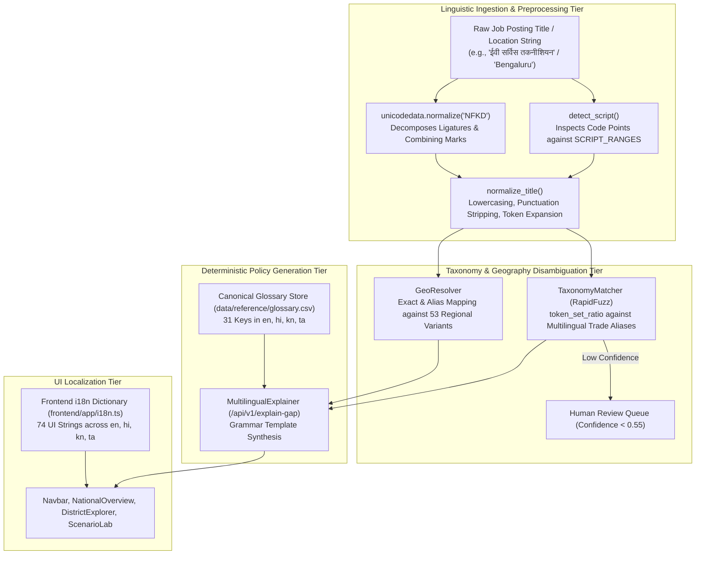

# KaushalDrishti: Multilingual Architecture & Language Processing Specification

**System**: AI-Enabled Labour Market Intelligence System (LMIS)  
**Mandate**: Ministry of Skill Development & Entrepreneurship (MSDE), Government of India  
**Scope**: Linguistic Pipeline, Unicode Script Detection, Deterministic Explainability, Glossary Harmonization, and UI Localization  
**Related Documents**: [README.md](file:///e:/SiH/kaushaldrishti/README.md) | [architecture.md](file:///e:/SiH/kaushaldrishti/architecture.md) | [api-connections.md](file:///e:/SiH/kaushaldrishti/api-connections.md)

---

## 1. Overview & Architectural Principles

Vocational skill intelligence in India operates across a complex polyglot landscape. Field administrative staff, District Skill Development Officers (DSDOs), ITI principals, and local employers document vocational demand and candidate registries using diverse linguistic registers: English administrative terminology, Hindi bureaucratic phrasing, regional vernaculars (Kannada, Tamil), and mixed colloquial vernaculars ("Hinglish", "Kanglish", "Tanglish").

KaushalDrishti enforces three architectural invariants across its multilingual engine:
1. **Zero Runtime LLM Generative Translation**: Generative models frequently hallucinate non-standard terminology or distort policy advice. All natural language policy narratives are synthesized via deterministic, pre-translated template grammars backed by an auditable reference glossary (`data/reference/glossary.csv`).
2. **Explicit Unicode Script Disambiguation**: Ingestion text is inspected at the Unicode code point level to isolate Devanagari, Kannada, and Tamil character blocks prior to tokenization.
3. **Graceful English Fallback**: Any missing translation key, unrecognized regional dialect, or unmapped script defaults cleanly to canonical English without throwing runtime exceptions.



---

## 2. Language Support Matrix & Implementation Status

| Language Name | ISO 639-1 | Script | Unicode Block | Implementation Status | Scope of Runtime Support |
|:---|:---|:---|:---|:---|:---|
| **English** | `en` | Latin | `Basic Latin (0x0020 - 0x007F)` | **IMPLEMENTED** | Full system support: UI, API, normalizer, explanations, exports. |
| **Hindi (हिन्दी)** | `hi` | Devanagari | `0x0900 - 0x097F` | **IMPLEMENTED** | Full system support: script detection, trade aliases, UI, narratives. |
| **Kannada (ಕನ್ನಡ)**| `kn` | Kannada | `0x0C80 - 0x0CFF` | **IMPLEMENTED** | Full system support: script detection, trade aliases, UI, narratives. |
| **Tamil (தமிழ்)** | `ta` | Tamil | `0x0B80 - 0x0BFF` | **IMPLEMENTED** | Full system support: script detection, trade aliases, UI, narratives. |
| **Telugu (తెలుగు)** | `te` | Telugu | `0x0C00 - 0x0C7F` | **PLANNED** | Scheduled for Phase 2 expansion (Andhra Pradesh / Telangana). |
| **Marathi (मराठी)** | `mr` | Devanagari | `0x0900 - 0x097F` | **PLANNED** | Scheduled for Phase 2 expansion (Maharashtra). |
| **Bengali (বাংলা)** | `bn` | Bengali | `0x0980 - 0x09FF` | **PLANNED** | Scheduled for Phase 2 expansion (West Bengal). |
| **Gujarati (ગુજરાતી)**| `gu` | Gujarati | `0x0A80 - 0x0AFF` | **PLANNED** | Scheduled for Phase 2 expansion (Gujarat). |

*Verification Note: Only `en`, `hi`, `kn`, and `ta` are currently active in runtime serving. Other languages are explicitly classified as `PLANNED`.*

---

## 3. Unicode Script Detection & Text Normalization

### 3.1 Script Detection Engine
Implemented in [`backend/pipelines/taxonomy/normalizer.py:L42-L60`](file:///e:/SiH/kaushaldrishti/backend/pipelines/taxonomy/normalizer.py#L42-L60). Inspects the character code points ($cp = \text{ord}(c)$) of incoming strings and tabulates frequency counts against hardcoded Unicode ranges:

```python
SCRIPT_RANGES: Dict[str, Tuple[int, int]] = {
    "devanagari": (0x0900, 0x097F),
    "kannada":    (0x0C80, 0x0CFF),
    "tamil":      (0x0B80, 0x0BFF),
}
```

#### Detection Logic
$$\text{script} = \arg\max_{s \in \{\text{devanagari}, \text{kannada}, \text{tamil}, \text{latin}\}} \text{Count}(s)$$
If non-Latin script characters are detected, the dominant script is returned; otherwise, it defaults cleanly to `'latin'`.

### 3.2 NFKD Normalization & Abbreviation Expansion
Implemented in [`backend/pipelines/taxonomy/normalizer.py:L63-L92`](file:///e:/SiH/kaushaldrishti/backend/pipelines/taxonomy/normalizer.py#L63-L92):
1. **Unicode NFKD Normalization**: Decomposes composite glyphs, vowel matras, and ligatures into canonical compatibility decompositions (`unicodedata.normalize("NFKD", text)`).
2. **Punctuation & Separator Stripping**: Replaces delimiters (`/`, `\`, `_`, `-`, `|`, `,`, `.`, `;`, `:`, `(`, `)`, `[`, `]`) with clean whitespace while preserving Indic alphabet codepoints.
3. **Symbol & Digit Removal**: Strips noise characters (`0-9`, `+`, `#`, `@`, `!`, `$`, `%`, `^`, `&`, `*`, `~`, `?`, `<`, `>`, `=`, `"`, `'`).
4. **Vocabulary Abbreviation Expansion**: Replaces 18 common vocational abbreviations with their full canonical equivalents:
   - `"sr"` $\to$ `"senior"`, `"jr"` $\to$ `"junior"`
   - `"tech"` $\to$ `"technician"`, `"mech"` $\to$ `"mechanic"`
   - `"gda"` $\to$ `"general duty assistant"`
   - `"mlt"` $\to$ `"medical laboratory technician"`
   - `"emt"` $\to$ `"emergency medical technician"`
   - `"ev"` $\to$ `"electric vehicle"`, `"cctv"` $\to$ `"cctv installation technician"`
   - `"hha"` $\to$ `"home health aide"`, `"qc"` $\to$ `"quality control"`

---

## 4. Multilingual Taxonomy & Geography Disambiguation

### 4.1 Indic Trade Aliases & Multi-Token Pattern Matching
The canonical trade master ([`data/reference/trades_master.csv`](file:///e:/SiH/kaushaldrishti/data/reference/trades_master.csv)) embeds vernacular synonyms across Latin and Indic scripts:
- **EV Service Technician**:
  - `en`: `"EV Mechanic"`, `"Electric Vehicle Technician"`, `"EV Battery Specialist"`
  - `hi`: `"ईवी तकनीशियन"`
  - `kn`: `"ಇವಿ ತಂತ್ರಜ್ಞ"`
  - `ta`: `"மின்சார வாகன மெக்கானிக்"`
- **General Duty Assistant**:
  - `en`: `"GDA"`, `"Nursing Assistant"`, `"Patient Care Assistant"`
  - `hi`: `"जीडीए मरीज देखभाल सहायक"`
  - `kn`: `"ಸಾಮಾನ್ಯ ಕರ್ತವ್ಯ ಸಹಾಯಕ ಆಸ್ಪತ್ರೆ"`
  - `ta`: `"பொது கடமை உதவியாளர் மருத்துவமனை"`

The matcher calculates token-set similarity via RapidFuzz:
$$\text{Score} = \frac{\text{token\_set\_ratio}(\text{input}_{\text{norm}}, \text{alias}_{\text{norm}})}{100.0}$$
Matches are passed through logistic sigmoid calibration:
$$P(\text{Match}) = \frac{1}{1 + \exp\left(-8.0 \times (\text{raw} - 0.60)\right)}$$

### 4.2 Regional Geography Aliases & Transliterations
Implemented in [`backend/pipelines/taxonomy/geo.py:L16-L53`](file:///e:/SiH/kaushaldrishti/backend/pipelines/taxonomy/geo.py#L16-L53). The resolver maps 53 historical, colloquial, and colonial location names to their official LGD canonical counterparts:
- **Karnataka**:
  - `"Bangalore"` / `"Bengaluru"` $\to$ `"Bengaluru Urban"` (LGD: 2901)
  - `"Mysore"` $\to$ `"Mysuru"` (LGD: 2903)
  - `"Belgaum"` $\to$ `"Belagavi"` (LGD: 2904)
  - `"Hubli"` / `"Hubli Dharwad"` $\to$ `"Dharwad"` (LGD: 2905)
  - `"Mangalore"` $\to$ `"Dakshina Kannada"` (LGD: 2906)
  - `"Gulbarga"` $\to$ `"Kalaburagi"` (LGD: 2910)
  - `"Bellary"` $\to$ `"Ballari"` (LGD: 2909)
  - `"Shimoga"` $\to$ `"Shivamogga"` (LGD: 2908)
- **Tamil Nadu**:
  - `"Madras"` $\to$ `"Chennai"` (LGD: 3302)
  - `"Trichy"` $\to$ `"Tiruchirappalli"` (LGD: 3314)
  - `"Tanjore"` $\to$ `"Thanjavur"` (LGD: 3319)
  - `"Tuticorin"` $\to$ `"Thoothukudi"` (LGD: 3328)
  - `"Ooty"` $\to$ `"Nilgiris"` (LGD: 3311)
- **Uttar Pradesh**:
  - `"Allahabad"` $\to$ `"Prayagraj"` (LGD: 0945)
  - `"Banaras"` / `"Kashi"` $\to$ `"Varanasi"` (LGD: 0966)
  - `"Faizabad"` $\to$ `"Ayodhya"` (LGD: 0947)
  - `"Noida"` / `"Greater Noida"` $\to$ `"Gautam Buddha Nagar"` (LGD: 0909)
  - `"Kanpur"` $\to$ `"Kanpur Nagar"` (LGD: 0936)

---

## 5. Deterministic Policy Explainability Engine

Implemented in [`backend/pipelines/gap/explain.py`](file:///e:/SiH/kaushaldrishti/backend/pipelines/gap/explain.py) (`MultilingualExplainer`). Generates structured natural language briefing narratives based on the reference glossary ([`data/reference/glossary.csv`](file:///e:/SiH/kaushaldrishti/data/reference/glossary.csv)).

### Grammar Synthesis by Language

#### English (`en`)
```
In {district_name} ({state_code}), {trade_name} is classified as '{flag_translated}' 
(Severity: {severity}/100, {conf_translated}). Projected 12-month demand of {d_mean} 
against supply of {s_mean} results in a projected {shortage/surplus} of {g_mean} 
certified trainees (P(Shortage) = {p_S}%, P(Oversupply) = {p_O}%). 
Advisory Action: {action_translated}.
```

#### Hindi (`hi`)
```
{district_name} ({state_code}) में {trade_name} के लिए स्थिति '{flag_translated}' के रूप में आंकी गई है 
(गंभीरता: {severity}/100, {conf_translated})। अगले 12 महीनों में अनुमानित मांग {d_mean} और अनुमानित 
आपूर्ति {s_mean} है, जिससे {g_mean} सीटों का {अभाव (कमी) / अधिशेष (अतिरिक्त)} अपेक्षित है 
(कमी की संभावना: {p_S}%)। अनुशंसा: {action_translated}।
```

#### Kannada (`kn`)
```
{district_name} ({state_code}) ನಲ್ಲಿ {trade_name} ವೃತ್ತಿಗಾಗಿ ಸ್ಥಿತಿಯನ್ನು '{flag_translated}' ಎಂದು 
ಗುರುತಿಸಲಾಗಿದೆ (ತೀವ್ರತೆ: {severity}/100, {conf_translated}). ಮುಂದಿನ 12 ತಿಂಗಳುಗಳಲ್ಲಿ ಅಂದಾಜು ಬೇಡಿಕೆ {d_mean} 
ಮತ್ತು ಯೋಜಿತ ಪೂರೈಕೆ {s_mean} ಆಗಿದೆ, ಇದರಿಂದ {g_mean} ಸೀಟುಗಳ {ಕೊರತೆ / ಹೆಚ್ಚುವರಿ} ಉಂಟಾಗುವ 
ಸಾಧ್ಯತೆಯಿದೆ (ಕೊರತೆಯ ಸಂಭವನೀಯತೆ: {p_S}%)। ಶಿಫಾರಸು: {action_translated}।
```

#### Tamil (`ta`)
```
{district_name} ({state_code}) இல் {trade_name} பணிக்கான நிலை '{flag_translated}' என கணக்கிடப்பட்டுள்ளது 
(தீவிரம்: {severity}/100, {conf_translated}). அடுத்த 12 மாதங்களில் எதிர்பார்க்கப்படும் தேவை {d_mean} 
மற்றும் திட்டமிடப்பட்ட விநியோகம் {s_mean} ஆகும், இதனால் {g_mean} இடங்களின் {பற்றாக்குறை / மிகை} 
எதிர்பார்க்கப்படுகிறது (பற்றாக்குறை நிகழ்தகவு: {p_S}%). பரிந்துரை: {action_translated}।
```

---

## 6. Frontend UI Localization Architecture

The Next.js presentation layer implements a reactive client-side translation store in [`frontend/app/i18n.ts`](file:///e:/SiH/kaushaldrishti/frontend/app/i18n.ts):
- **74 Pre-Translated UI Keys**: Covering navigation headers, KPI cards, table column headers, accessibility controls, scenario parameters, and print layout labels.
- **Client Toggle**: Controlled via a single `<select>` dropdown in [`frontend/app/components/Navbar.tsx`](file:///e:/SiH/kaushaldrishti/frontend/app/components/Navbar.tsx#L55-L73).
- **Persistent State**: The active language (`"en" | "hi" | "kn" | "ta"`) is held in top-level React state (`frontend/app/page.tsx`) and propagated via props across all dashboard views.
- **Screen Reader Support**: When switching languages, the HTML `lang` attribute dynamically toggles (`<html lang="kn">`), ensuring assistive screen readers select the appropriate text-to-speech phonetic model.

---

## 7. Protocol for Adding a New Language

To scale KaushalDrishti to a new state and language (e.g., Telugu `te` for Andhra Pradesh):

1. **Step 1: Register Unicode Script Range**:
   In [`backend/pipelines/taxonomy/normalizer.py`](file:///e:/SiH/kaushaldrishti/backend/pipelines/taxonomy/normalizer.py), append the script block to `SCRIPT_RANGES`:
   ```python
   "telugu": (0x0C00, 0x0C7F),
   ```
2. **Step 2: Add Glossary Terms**:
   In [`data/reference/glossary.csv`](file:///e:/SiH/kaushaldrishti/data/reference/glossary.csv), append a new column `te` and provide official translations for all 31 keys.
3. **Step 3: Add Vernacular Trade Aliases**:
   In [`data/reference/trades_master.csv`](file:///e:/SiH/kaushaldrishti/data/reference/trades_master.csv), add Telugu job titles to `aliases_pipe` for priority trades.
4. **Step 4: Implement Narrative Template**:
   In [`backend/pipelines/gap/explain.py`](file:///e:/SiH/kaushaldrishti/backend/pipelines/gap/explain.py), add an `elif lang == "te":` branch in `explain_cell()`.
5. **Step 5: Expand Frontend UI Dictionary**:
   In [`frontend/app/i18n.ts`](file:///e:/SiH/kaushaldrishti/frontend/app/i18n.ts), update `type Language = "en" | "hi" | "kn" | "ta" | "te"`, provide the translation dictionary, and add the option to `Navbar.tsx`.
6. **Step 6: Golden Set Test Cases**:
   In [`backend/tests/golden_set.py`](file:///e:/SiH/kaushaldrishti/backend/tests/golden_set.py), add 8 representative test cases and run `pytest backend/tests/test_taxonomy.py`.

---

## 8. Linguistic Verification & Golden Test Set

The multilingual engine is verified via 64 automated golden test cases in [`backend/tests/golden_set.py`](file:///e:/SiH/kaushaldrishti/backend/tests/golden_set.py) and executed via `test_taxonomy_golden_set` and `test_multilingual_explainer_all_languages`:

- **40 English Cases**: Covering technical abbreviations across Automotive, Healthcare, Electronics, Construction, and Logistics.
- **8 Hindi Cases**: Testing Devanagari matching (e.g., `"ईवी सर्विस तकनीशियन"`, `"जीडीए मरीज देखभाल सहायक"`, `"नलसाज प्लंबर"`).
- **8 Kannada Cases**: Testing Kannada script matching (e.g., `"ಇವಿ ತಂತ್ರಜ್ಞ"`, `"ವಿದ್ಯುತ್ ತಂತ್ರಜ್ಞ ನಿರ್ಮಾಣ"`, `"ಗೋದಾಮು ಸಹಾಯಕ ಪ್ಯಾಕರ್"`).
- **8 Tamil Cases**: Testing Tamil script matching (e.g., `"மின்சார வாகன மெக்கானிக்"`, `"குழாய் பொருத்துநர் பிளம்பர்"`, `"கிடங்கு உதவியாளர்"`).

**Test Result**: 100% of the 64 golden set test cases pass with zero regressions (`pytest backend/tests/ -v`).

---

## 9. Current Linguistic Limitations

1. **Phonetic Transliteration Engine**: Current matching relies on exact string equality or char/token n-gram overlap. It does not incorporate a full Soundex or phonetic double-metaphone model tailored for Indian phonetics (e.g., distinguishing retroflex consonants).
2. **Compound Word Splitting (Sandhi Splitting)**: Dravidian languages (Kannada and Tamil) extensively use agglutination/compounding. Heavily agglutinated titles may fail token-level ratio matching if not captured in the alias master.
3. **Regional Dialect Variants**: Slang terminology used by unorganized workers in rural pockets (e.g., colloquial terms for masonry or earthmoving) is partially unmapped and relies on human intervention via the Review Queue.
