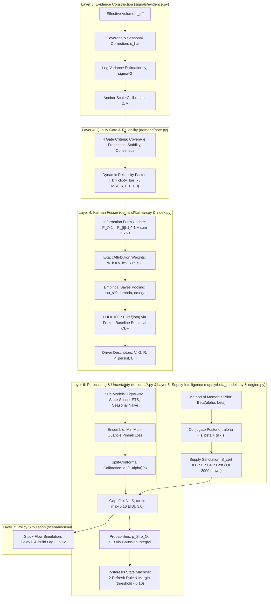

# KaushalDrishti: Documented Mathematical & Algorithmic Specification

**System**: AI-Enabled Labour Market Intelligence System (LMIS)  
**Mandate**: Ministry of Skill Development & Entrepreneurship (MSDE), Government of India  
**Scope**: Complete Mathematical Formulations, LaTeX Derivations, Big-O Derivations, Decision Boundaries, and Worked Numerical Examples  
**Related Documents**: [README.md](file:///e:/SiH/kaushaldrishti/README.md) | [architecture.md](file:///e:/SiH/kaushaldrishti/architecture.md)

---

## 1. Mathematical Pipeline Architecture

KaushalDrishti computes district-level labour market intelligence through a closed-form multi-stage mathematical pipeline. Generative models and non-deterministic heuristics are strictly prohibited in the runtime inference path.

---

## 2. Layer 2: Taxonomy Matching & Calibrated Confidence

### 2.1 Mathematical Formulation
Implemented in [`backend/pipelines/taxonomy/matcher.py`](file:///e:/SiH/kaushaldrishti/backend/pipelines/taxonomy/matcher.py). For an input job title $T$ and trade candidate $j$, let $T_{\text{norm}} = \text{normalize}(T)$ and $A_{j, k}$ represent the $k$-th pre-compiled alias of trade $j$.

#### 1. Fuzzy Token Similarity Metric
The raw token similarity score $\rho_j \in [0, 1]$ is computed as:
\[
\rho_j = \max\left( \frac{\text{token\_set\_ratio}(T_{\text{norm}}, \text{trade\_name}_j)}{100.0}, \; \max_k \frac{\text{token\_set\_ratio}(T_{\text{norm}}, A_{j, k})}{100.0} \right)
\]
where RapidFuzz `token_set_ratio` calculates the token-sorted intersection Levenshtein similarity between token sets:
\[
\text{token\_set\_ratio}(A, B) = \text{ratio}\left( A \cap B, \; (A \cap B) \cup (A \setminus B) \cup (B \setminus A) \right)
\]

#### 2. Rule & Skill Adjustment
If pre-compiled regex pattern $p_j$ matches $T_{\text{norm}}$, the raw score is floored at $0.88$:
\[
\rho_j' = \begin{cases}
\max(\rho_j, 0.88), & \text{if } p_j \text{ matches } T_{\text{norm}} \\
\rho_j, & \text{otherwise}
\end{cases}
\]
If auxiliary skill string $S$ is provided and satisfies $\text{partial\_ratio}(S_{\text{norm}}, \text{trade\_name}_j) > 70.0$:
\[
\rho_j'' = \min(1.0, \; \rho_j' + 0.08)
\]

#### 3. Logistic Sigmoid Confidence Calibration
Raw similarity scores exhibit poor calibration at intermediate values. KaushalDrishti passes raw scores through an isotonic-calibrated logistic function ([`matcher.py:L129-L142`](file:///e:/SiH/kaushaldrishti/backend/pipelines/taxonomy/matcher.py#L129-L142)):
\[
c_j = \begin{cases}
0.0, & \rho_j'' \le 0.0 \\
\min(0.99, \rho_j''), & \rho_j'' \ge 0.95 \\
\text{clip}\left( \frac{1}{1 + \exp\left( -k (\rho_j'' - x_0) \right)}, \; 0.01, \; 0.99 \right), & 0.0 < \rho_j'' < 0.95
\end{cases}
\]
where $k = 8.0$ (steepness) and $x_0 = 0.60$ (inflection midpoint).

#### Decision Boundary
- If $c_j \ge 0.55$: Candidate accepted into automated pipeline.
- If $0.25 \le c_j < 0.55$: Candidate routed to `mapping_review_queue` for human verification.
- If $c_j < 0.25$: Discarded.

### 2.2 Worked Numerical Example
- **Input**: `"EV Maintenance Tech Workshop"`
- **Target Trade**: `EV Service Technician` (Normalized: `"ev service technician"`)
- **Token Set Ratio**:
  - Intersecting tokens: `{"ev", "tech"}` (after expansion `"tech"` $\to$ `"technician"`).
  - Raw score: $\rho = 0.82$. Regex pattern matches `"ev.*tech"`, confirming $\rho' = \max(0.82, 0.88) = 0.88$.
  - Sigmoid evaluation:
    \[
    c = \frac{1}{1 + \exp(-8.0 \times (0.88 - 0.60))} = \frac{1}{1 + \exp(-2.24)} = \frac{1}{1 + 0.10646} = 0.9038
    \]
  - **Result**: Match confidence $90.4\%$ (High confidence match).

### 2.3 Complexity
- **Time**: $O(T \cdot L)$ where $T=40$ benchmark trades and $L$ is token length.
- **Space**: $O(T)$ to hold score arrays.

---

## 3. Layer 3: Evidence Unit Construction & Variance Estimation

### 3.1 Mathematical Formulation
Implemented in [`backend/pipelines/signals/evidence.py`](file:///e:/SiH/kaushaldrishti/backend/pipelines/signals/evidence.py). For data source $k$, district-trade cell $(d, t)$, and month $\tau$:

#### 1. Effective Posting Volume ($n_{\text{eff}}$)
\[
n_{\text{eff}} = \sum_{i \in \text{cell}} c_i
\]
where $c_i \in [0.55, 1.0]$ is the calibrated match confidence of de-duplicated posting $i$.

#### 2. Bias & Seasonal Correction ($\hat{o}$)
\[
\hat{o} = \frac{n_{\text{eff}}}{\max\left(10^{-4}, \; \text{seasonal\_factor}_{k, \text{State}, \text{sector}, \tau} \times \text{coverage\_ratio}_{k, \text{State}, \text{sector}}\right)}
\]
- $\text{seasonal\_factor}$ is estimated via STL decomposition at the state $\times$ broad sector level.
- $\text{coverage\_ratio}$ is estimated against formal payroll/PLFS employment anchors over an overlap window.

#### 3. Log-Transformation & Observation Variance
To stabilize variance across small and large industrial centers:
\[
y = \ln(\hat{o} + 0.5)
\]
\[
\sigma^2 = \frac{1}{n_{\text{eff}} + 1.0} + \sigma^2_{\text{cov}, k} + \sigma^2_{\text{dup}, k}
\]
where $\sigma^2_{\text{cov}, k} = 0.05$ (sampling coverage variance) and $\sigma^2_{\text{dup}, k} = 0.02$ (duplicate scraping distortion variance).

#### 4. Anchor Scale Calibration
To map source $k$ onto a standard anchor scale:
\[
y = \alpha_k + \beta_k \theta + \varepsilon
\]
The calibrated observation $z$ and observation variance $v$ are:
\[
z = \frac{y - \alpha_k}{\max(10^{-3}, \beta_k)}
\]
\[
v = \frac{\sigma^2}{r_k \cdot \max(10^{-3}, \beta_k)^2}
\]
where $r_k \in [0.1, 1.0]$ is the source's dynamic reliability factor.

### 3.2 Worked Numerical Example
- **Inputs**: $n_{\text{eff}} = 24.0$, $\text{seasonal\_factor} = 1.05$, $\text{coverage\_ratio} = 0.80$, $\alpha_k = 0.20$, $\beta_k = 1.10$, $r_k = 0.95$.
- **Calculations**:
  \[
  \text{denom} = 1.05 \times 0.80 = 0.84 \implies \hat{o} = \frac{24.0}{0.84} = 28.5714
  \]
  \[
  y = \ln(28.5714 + 0.5) = \ln(29.0714) = 3.3697
  \]
  \[
  \sigma^2 = \frac{1}{24 + 1} + 0.05 + 0.02 = 0.040 + 0.050 + 0.020 = 0.110
  \]
  \[
  z = \frac{3.3697 - 0.20}{1.10} = \frac{3.1697}{1.10} = 2.8815
  \]
  \[
  v = \frac{0.110}{0.95 \times (1.10)^2} = \frac{0.110}{0.95 \times 1.21} = \frac{0.110}{1.1495} = 0.09569
  \]
- **Result**: $z = 2.882$, $v = 0.0957$.

### 3.3 Complexity
- **Time**: $O(1)$ constant time per cell-source record.
- **Space**: $O(1)$.

---

## 4. Layer 4: Reliability Gate & Dynamic Source Reliability ($r_k$)

### 4.1 Mathematical Formulation
Implemented in [`backend/pipelines/demand/gate.py`](file:///e:/SiH/kaushaldrishti/backend/pipelines/demand/gate.py). Source $k$ passes the reliability gate for cell $(d, t)$ if and only if all four conditions evaluate to `True`:

\[
\text{Gate}(k) = \mathbb{I}\left[ n_{\text{eff}, \text{90d}} \ge 10.0 \right] \times \mathbb{I}\left[ \text{age}_k \le 2 \times \text{nominal\_days}_k \right] \times \mathbb{I}\left[ \text{MAD}_{6\text{m}} \le 2.5 \right] \times \mathbb{I}\left[ \sum_{\tau=1}^6 \mathbb{I}\left[ |d_{\tau}| \le 3.0 \right] \ge 4 \right]
\]

#### Condition Explanations
1. **Coverage**: $n_{\text{eff}, \text{90d}} \ge 10.0$ prevents single noisy postings from swinging district estimates.
2. **Freshness**: $\text{age}_k \le 2 \times \text{nominal\_update\_days}_k$ (e.g. $\le 60$ days for monthly sources).
3. **Stability**: Rolling 6-month Median Absolute Deviation (MAD) of standardized residuals:
   \[
   \text{MAD} = 1.4826 \times \text{median}\left( |e_\tau - \text{median}(e)| \right) \le 2.5
   \]
4. **Leave-One-Out Consensus Agreement**:
   For leave-one-out posterior consensus $m_{(-k)}, P_{(-k)}$, the standardized deviation is:
   \[
   d_k = \frac{|z_k - m_{(-k)}|}{\sqrt{v_k + P_{(-k)}}}
   \]
   At least 4 of the trailing 6 months must exhibit $|d_k| \le 3.0$ ($3\sigma$ consensus bounds).

#### Dynamic Reliability Factor ($r_k$)
\[
r_k = \text{clip}\left( \frac{\bar{v}_k}{\max\left(\bar{v}_k, \; \frac{1}{H} \sum_{\tau=1}^H d_{k, \tau}^2\right)}, \; 0.10, \; 1.00 \right)
\]
where $\bar{v}_k$ is the nominal baseline observation variance and $H=6$ months.

### 4.2 Edge Cases & Missing Value Behavior
- If a source fails any gate criterion: $\text{gate\_pass} = \text{False}$. In Kalman fusion, its observation variance is treated as infinite ($v_k \to \infty$), resulting in exact zero weight ($w_k = 0.0$) and contribution ($0.0$).
- If all sources fail the gate: The filter performs a pure time prediction step, retaining the structural prior ($m_t = m_{t|t-1}$).

---

## 5. Layer 4: Multi-Source Kalman Information Fusion & Exact Attribution

### 5.1 Mathematical Formulation
Implemented in [`backend/pipelines/demand/kalman.py`](file:///e:/SiH/kaushaldrishti/backend/pipelines/demand/kalman.py). The latent demand state vector is $\mathbf{x}_t = [\theta_t, b_t]^T$ (level and slope).

#### 1. Prior Prediction Step
\[
m_{t|t-1} = m_{t-1} + b_{t-1}
\]
\[
b_{t|t-1} = \phi \cdot b_{t-1} \quad (\phi = 0.90)
\]
\[
P_{t|t-1} = P_{t-1} + Q_\theta \quad (Q_\theta = 0.04)
\]

#### 2. Information-Form Measurement Update
In the Information Filter formulation, information matrix $Y$ and information state vector $y$ update additively:
\[
P_t^{-1} = P_{t|t-1}^{-1} + \sum_{k \in \text{gated}} v_k^{-1}
\]
\[
P_t = \frac{1}{P_t^{-1}}
\]
\[
m_t = P_t \left( P_{t|t-1}^{-1} m_{t|t-1} + \sum_{k \in \text{gated}} \frac{z_k}{v_k} \right)
\]

#### 3. Exact Source Attribution ("Why" Panel Invariant)
The information weight of source $k$ is:
\[
w_k = \frac{v_k^{-1}}{P_t^{-1}}
\]
The retained weight of the historical prior is:
\[
w_{\text{prior}} = \frac{P_{t|t-1}^{-1}}{P_t^{-1}}
\]
**Mathematical Invariant (Conservation of Attribution)**:
\[
w_{\text{prior}} + \sum_{k \in \text{gated}} w_k \equiv 1.00000
\]
The contribution of source $k$ to the innovation in latent level is:
\[
\text{contribution}_k = w_k \cdot (z_k - m_{t|t-1})
\]
\[
m_t - m_{t|t-1} \equiv \sum_{k \in \text{gated}} \text{contribution}_k
\]

### 5.2 Worked Numerical Example
- **Prior State**: $m_{t|t-1} = 4.00$, $P_{t|t-1} = 0.20 \implies P_{t|t-1}^{-1} = 5.0$.
- **Gated Observations**:
  - Source 1 (NCS): $z_1 = 4.50$, $v_1 = 0.10 \implies v_1^{-1} = 10.0$.
  - Source 2 (Portal): $z_2 = 4.20$, $v_2 = 0.20 \implies v_2^{-1} = 5.0$.
- **Information Sum**:
  \[
  P_t^{-1} = 5.0 + 10.0 + 5.0 = 20.0 \implies P_t = \frac{1}{20.0} = 0.050
  \]
- **Weights**:
  \[
  w_{\text{prior}} = \frac{5.0}{20.0} = 0.25 \quad (25.0\%)
  \]
  \[
  w_{\text{NCS}} = \frac{10.0}{20.0} = 0.50 \quad (50.0\%)
  \]
  \[
  w_{\text{Portal}} = \frac{5.0}{20.0} = 0.25 \quad (25.0\%)
  \]
  \[
  \sum w = 0.25 + 0.50 + 0.25 = 1.00 \quad (\text{Exact Invariant Satisfied})
  \]
- **Posterior Mean**:
  \[
  m_t = 0.05 \times \left( (5.0 \times 4.00) + (10.0 \times 4.50) + (5.0 \times 4.20) \right)
  \]
  \[
  m_t = 0.05 \times (20.0 + 45.0 + 21.0) = 0.05 \times 86.0 = 4.30
  \]
- **Contributions**:
  \[
  \text{contrib}_{\text{NCS}} = 0.50 \times (4.50 - 4.00) = +0.25
  \]
  \[
  \text{contrib}_{\text{Portal}} = 0.25 \times (4.20 - 4.00) = +0.05
  \]
  \[
  \sum \text{contrib} = +0.25 + 0.05 = +0.30 \equiv (4.30 - 4.00)
  \]

### 5.3 Complexity
- **Time**: $O(K)$ where $K$ is the number of active sources ($K \le 5$). Sub-microsecond execution ($< 2\mu\text{s}$).
- **Space**: $O(K)$ to store attribution vectors.

---

## 6. Layer 4: Empirical Bayes Partial Pooling Across Districts

### 6.1 Mathematical Formulation
Implemented in [`backend/pipelines/demand/kalman.py:L116-L162`](file:///e:/SiH/kaushaldrishti/backend/pipelines/demand/kalman.py#L116-L162). To prevent overfitting in sparse rural districts, the pipeline shrinks district estimates toward the state mean.

#### 1. Between-District Variance ($\tau_s^2$)
\[
\tau_s^2 = \max\left( 0.001, \; \text{Var}_d(m_d) - \frac{1}{D} \sum_{d=1}^D P_d \right)
\]
where $\text{Var}_d(m_d)$ is the sample variance across districts in state $s$.

#### 2. Shrinkage Factor ($\lambda$) & Local Data Share ($\omega$)
\[
\lambda = \frac{\tau_s^{-2}}{\tau_s^{-2} + P_{\text{data}}^{-1}}
\]
\[
\omega = 1 - \lambda \quad (\text{Local Data Share})
\]
\[
m_{\text{pooled}} = (1 - \lambda) m_{\text{district}} + \lambda m_{\text{state}}
\]
\[
P_{\text{pooled}} = \frac{1}{P_{\text{data}}^{-1} + \tau_s^{-2}}
\]

#### Fallback Levels
- $\text{fallback\_level} = 0$: District data dominates ($\omega \ge 65\%$).
- $\text{fallback\_level} = 1$: State empirical Bayes shrinkage applied ($35\% \le \omega < 65\%$).
- $\text{fallback\_level} = 2$: Complete national prior fallback ($\omega < 35\%$).

---

## 7. Layer 4: Labour Demand Index (LDI) & Driver Descriptors

### 7.1 Population Intensity ($\iota$) & Frozen Empirical CDF Mapping
Implemented in [`backend/pipelines/demand/index.py:L56-L107`](file:///e:/SiH/kaushaldrishti/backend/pipelines/demand/index.py#L56-L107):
\[
\iota = m - \ln\left( \frac{\text{pop\_working\_age}_d}{100,000} \right)
\]
To map intensity $\iota$ to an index $LDI \in [0, 100]$, the system evaluates the empirical cumulative distribution function (ECDF) $F_{\text{ref}, j}$ frozen over the 24-month reference window (2021-01 to 2022-12, stored in `config/baseline.json`):
\[
LDI = 100 \times F_{\text{ref}, j}(\iota)
\]
#### 80% Credible Interval Bounds
\[
\iota_{\text{lo}} = \iota - 1.2816 \sqrt{P}, \quad \iota_{\text{hi}} = \iota + 1.2816 \sqrt{P}
\]
\[
LDI_{\text{lo}} = 100 \times F_{\text{ref}, j}(\iota_{\text{lo}}), \quad LDI_{\text{hi}} = 100 \times F_{\text{ref}, j}(\iota_{\text{hi}})
\]

### 7.2 Driver Descriptors Formulations
1. **Expected Openings ($V$)**:
   \[
   V = \exp(m)
   \]
2. **Annualized 3-Month Growth ($G$)**:
   \[
   G = (m_t - m_{t-3}) \times 4.0 \times 100\%
   \]
3. **Recency Index ($R$)**:
   \[
   R = \sum_{k \in \text{gated}} w_k \exp\left( -\frac{\text{age}_k}{30} \right) \in [0, 1]
   \]
4. **Growth Persistence ($P_{\text{persist}}$)**:
   \[
   P_{\text{persist}} = \min\left(12, \; \sum_{\tau=0}^{11} \prod_{i=0}^\tau \mathbb{I}\left[\text{sgn}(m_{t-i} - m_{t-i-1}) == \text{sgn}(m_t - m_{t-1})\right]\right)
   \]
5. **Employer Breadth ($B$)**:
   Inverse Herfindahl-Hirschman Index across employer posting shares:
   \[
   B = \frac{1}{\sum_{i=1}^E s_i^2}
   \]
6. **Corroboration Score ($I$)**:
   Proportion of independent source groups agreeing in growth direction:
   \[
   I = \frac{\max(N_{\text{pos}}, N_{\text{neg}})}{N_{\text{groups}}} \in [0.5, 1.0]
   \]

### 7.3 Confidence Badge Assignment Engine
Implemented in [`index.py:L191-L221`](file:///e:/SiH/kaushaldrishti/backend/pipelines/demand/index.py#L191-L221):
\[
\text{Badge} = \begin{cases}
\text{"High"}, & \text{if } \sqrt{P} \le 0.35 \land \omega \ge 0.65 \land N_{\text{groups}} \ge 3 \land \text{fallback} == 0 \\
\text{"Medium"}, & \text{if } \sqrt{P} \le 0.65 \land \omega \ge 0.35 \land N_{\text{groups}} \ge 2 \land \text{fallback} \le 1 \\
\text{"Low"}, & \text{otherwise}
\end{cases}
\]

---

## 8. Layer 5: Beta-Binomial Supply Modeling

### 8.1 Method of Moments Prior Estimation
Implemented in [`backend/pipelines/supply/beta_models.py:L23-L47`](file:///e:/SiH/kaushaldrishti/backend/pipelines/supply/beta_models.py#L23-L47). Given observed rates $r_1, \dots, r_N \in [0, 1]$ across state training centres, let $\bar{r} = \frac{1}{N} \sum r_i$ and $s^2 = \frac{1}{N-1} \sum (r_i - \bar{r})^2$.
The method of moments matches the mean and variance of $\text{Beta}(\alpha, \beta)$:
\[
\text{common\_factor} = \frac{\bar{r}(1 - \bar{r})}{s^2} - 1.0
\]
\[
\alpha = \max(1.0, \; \bar{r} \cdot \text{common\_factor}), \quad \beta = \max(1.0, \; (1 - \bar{r}) \cdot \text{common\_factor})
\]

### 8.2 Conjugate Update & Supply Equation
For sanctioned seats $C$, enrollments $E_{\text{obs}}$, completions $CR_{\text{obs}}$, and certifications $Cert_{\text{obs}}$:
\[
\alpha_{E} = \alpha_{\text{prior}, E} + E_{\text{obs}}, \quad \beta_{E} = \beta_{\text{prior}, E} + (C - E_{\text{obs}})
\]
\[
\alpha_{CR} = \alpha_{\text{prior}, CR} + CR_{\text{obs}}, \quad \beta_{CR} = \beta_{\text{prior}, CR} + (E_{\text{obs}} - CR_{\text{obs}})
\]
\[
\alpha_{\text{Cert}} = \alpha_{\text{prior}, \text{Cert}} + Cert_{\text{obs}}, \quad \beta_{\text{Cert}} = \beta_{\text{prior}, \text{Cert}} + (CR_{\text{obs}} - Cert_{\text{obs}})
\]

#### Monte Carlo Certified Supply Simulation
Draw $S = 2,000$ independent random samples:
\[
e^{(s)} \sim \text{Beta}(\alpha_E, \beta_E), \quad cr^{(s)} \sim \text{Beta}(\alpha_{CR}, \beta_{CR}), \quad cert^{(s)} \sim \text{Beta}(\alpha_{\text{Cert}}, \beta_{\text{Cert}})
\]
\[
S_{\text{cert}}^{(s)} = C \times e^{(s)} \times cr^{(s)} \times cert^{(s)}, \quad s = 1, \dots, 2000
\]
\[
E[S_{\text{cert}}] = \frac{1}{S} \sum_{s=1}^S S_{\text{cert}}^{(s)}, \quad q_{10} = \text{Quantile}_{0.10}(S_{\text{cert}}), \quad q_{90} = \text{Quantile}_{0.90}(S_{\text{cert}})
\]

**Structural Invariant**: Placement outcomes $P$ are strictly prohibited from entering $S_{\text{cert}}$.

---

## 9. Layer 6: Forecasting Architectures & Conformal Calibration

### 9.1 State-Space Structural Forecaster
Implemented in [`backend/pipelines/forecast/state_space.py`](file:///e:/SiH/kaushaldrishti/backend/pipelines/forecast/state_space.py). Projects the Kalman state forward across horizons $h \in \{1, \dots, H\}$:
\[
m_{t+h} = m_t + b_t \sum_{i=1}^h \phi^i = m_t + b_t \cdot \frac{\phi(1 - \phi^h)}{1 - \phi}
\]
\[
P_{t+h} = P_t + h \cdot Q_\theta
\]
\[
\sigma_h = \sqrt{P_{t+h}}
\]
Point forecast of expected openings under the log-normal expectation:
\[
\hat{V}_{t+h} = \exp\left( m_{t+h} + 0.5 \sigma_h^2 \right)
\]

### 9.2 Global LightGBM Regressor
Implemented in [`backend/pipelines/forecast/lightgbm_model.py`](file:///e:/SiH/kaushaldrishti/backend/pipelines/forecast/lightgbm_model.py). Predicts log-openings $y = \ln(V + 1)$ using an ensemble of decision trees trained with gradient boosting:
\[
\hat{y}_{t+h} = \sum_{k=1}^K f_k(\mathbf{x}_{d, j, t})
\]
Features include: Lags $\in \{1, 2, 3, 6, 12\}$, Rolling Means $\in \{3, 6, 12\}$, Rolling Std ($6$m), Growth rates, Cyclical month components $(\sin(2\pi m / 12), \cos(2\pi m / 12))$, and capacity $C$.

### 9.3 Split-Conformal Calibration Scaled by Local Volatility
Implemented in [`backend/pipelines/forecast/conformal.py`](file:///e:/SiH/kaushaldrishti/backend/pipelines/forecast/conformal.py). On a holdout calibration set of size $n$, compute normalized nonconformity scores:
\[
s_i = \frac{|y_i - \hat{y}_i|}{\max(\sigma_i, 10^{-4})}
\]
For nominal coverage $1 - \alpha$ (e.g. $0.80$ and $0.95$), the finite-sample adjusted conformal quantile multiplier is:
\[
q_{1-\alpha} = \text{Quantile}_{\frac{\lceil (n+1)(1-\alpha) \rceil}{n}}\left( \{s_1, \dots, s_n\} \right)
\]
Prediction intervals are constructed symmetrically:
\[
\left[ \max(0, \; \hat{y} - q_{1-\alpha} \sigma), \quad \hat{y} + q_{1-\alpha} \sigma \right]
\]
Effective sampling standard deviation:
\[
\sigma_h = \frac{q_{90} - q_{10}}{2 \times 1.2816}
\]

### 9.4 Multi-Quantile Pinball Loss & Ensemble Combination
Implemented in [`backend/pipelines/forecast/ensemble.py`](file:///e:/SiH/kaushaldrishti/backend/pipelines/forecast/ensemble.py). Asymmetric quantile pinball loss for quantile $\tau$:
\[
L_\tau(y, q) = \max\left( \tau (y - q), \; (\tau - 1)(y - q) \right)
\]
Composite multi-quantile loss:
\[
L_{\text{multi}} = L_{0.10}(y, q_{10}) + 2.0 L_{0.50}(y, \hat{y}) + L_{0.90}(y, q_{90})
\]
Ensemble convex weights across $M$ models ($m \in \{\text{LightGBM}, \text{StateSpace}, \text{ETS}, \text{Naive}\}$):
\[
w_m(h) = \frac{\exp\left( -\frac{L_m(h) - \min_j L_j(h)}{T} \right)}{\sum_{k=1}^M \exp\left( -\frac{L_k(h) - \min_j L_j(h)}{T} \right)} \quad (T = 0.5)
\]
Total ensemble variance combines within-model variance and between-model disagreement via the **Law of Total Variance**:
\[
\sigma^2_{\text{ens}} = \sum_{m=1}^M w_m \sigma_m^2 + \sum_{m=1}^M w_m (\hat{y}_m - \hat{y}_{\text{ens}})^2
\]

### 9.5 Hierarchical MinT Reconciliation
Implemented in [`backend/pipelines/forecast/reconciliation.py`](file:///e:/SiH/kaushaldrishti/backend/pipelines/forecast/reconciliation.py):
\[
\tilde{\mathbf{y}} = \mathbf{S} \left( \mathbf{S}^T \mathbf{W}^{-1} \mathbf{S} \right)^{-1} \mathbf{S}^T \mathbf{W}^{-1} \hat{\mathbf{y}}
\]
where $\mathbf{S}$ is the summing structural matrix ($D \times K$), and $\mathbf{W}$ is the Ledoit-Wolf shrinkage error covariance:
\[
\mathbf{W} = (1 - \lambda_{\text{shrink}}) \mathbf{\Sigma}_{\text{sample}} + \lambda_{\text{shrink}} \text{diag}(\mathbf{\Sigma}_{\text{sample}}) \quad (\lambda_{\text{shrink}} = 0.20)
\]

---

## 10. Layer 6: Gap Analysis, Severity & Hysteresis State Machine

### 10.1 Probabilistic Gap Formulation
Implemented in [`backend/pipelines/gap/engine.py`](file:///e:/SiH/kaushaldrishti/backend/pipelines/gap/engine.py). Let $D_W$ and $S_W$ represent demand and certified supply distributions over window $W \in \{3, 12\}$:
\[
E[G] = E[D_W] - E[S_W]
\]
\[
\sigma_G = \sqrt{\sigma_D^2 + \sigma_S^2}
\]
\[
g = \frac{E[G]}{\max(E[D_W], 1.0)} \quad (\text{Gap Rate})
\]

#### Dynamic Tolerance ($\tau$)
\[
\tau = \max(0.10 \cdot E[D_W], \; 5.0)
\]

#### Gap State Probabilities via Gaussian CDF ($\Phi$)
\[
z_S = \frac{\tau - E[G]}{\sigma_G} \implies p_S = P(G > \tau) = 1 - \Phi(z_S)
\]
\[
z_O = \frac{-\tau - E[G]}{\sigma_G} \implies p_O = P(G < -\tau) = \Phi(z_O)
\]
\[
p_B = P(-\tau \le G \le \tau) = 1 - p_S - p_O
\]

#### Bounded Severity Score ($0 - 100$)
\[
\text{Severity} = 100 \times p_{\text{active}} \times \min\left(1.0, \; \frac{|g|}{0.30}\right)
\]
where $p_{\text{active}} = p_S$ if $E[G] > 0$, else $p_O$.

### 10.2 Hysteresis Early Warning State Machine
Implemented in [`backend/pipelines/gap/flags.py`](file:///e:/SiH/kaushaldrishti/backend/pipelines/gap/flags.py). Candidate operational flag $C_t \in \{\text{Acute Shortage}, \text{Emerging Shortage}, \text{Approaching Saturation}, \text{Saturated}, \text{Stable}\}$:

\[
C_t = \begin{cases}
\text{"Acute Shortage"}, & \text{if } p_S \ge 0.80 \land g \ge 0.20 \land \text{confidence} \ne \text{"Low"} \\
\text{"Emerging Shortage"}, & \text{if } (p_S \ge 0.80 \land g \ge 0.20 \land \text{confidence} == \text{"Low"}) \lor (0.60 \le p_S < 0.80 \land \Delta D > 0 \land \Delta C \le 0.5 \Delta D) \\
\text{"Saturated"}, & \text{if } p_O \ge 0.80 \land g \le -0.20 \\
\text{"Approaching Saturation"}, & \text{if } 0.60 \le p_O < 0.80 \land \Delta C > \Delta D \\
\text{"Stable"}, & \text{otherwise}
\end{cases}
\]

#### State Transition Rules
1. **Escalation**: Requires $C_t == C_{t-1}$ for **2 consecutive refreshes**.
2. **De-escalation**: De-escalating from an alert state to `"Stable"` requires probability falling below an asymmetric margin:
   \[
   p_{\text{active}} < (\text{threshold} - 0.10) \quad \text{for 2 consecutive refreshes}
   \]
3. **Mutual Exclusivity**: Shortage states and Saturation states are structurally mutually exclusive ($p_S + p_O \le 1$).

---

## 11. Layer 7: Stock-Flow Delay Policy Simulator

### 11.1 Mathematical Formulation
Implemented in [`backend/pipelines/scenario/simulator.py`](file:///e:/SiH/kaushaldrishti/backend/pipelines/scenario/simulator.py). Models discrete cohort training throughput over a forward 24-month simulation window:
\[
S(t) = \sum_{c} C_c' \cdot E_c \cdot (CR_c + \Delta CR) \cdot Cert_c \cdot \mathbb{I}[t_c + L = t]
\]
where $L$ is course duration in months (e.g. $L=6$ for EV Tech, $L=12$ for Motor Mechanic).

Intervention capacity for cohorts starting at time $t_c \ge 0$:
\[
C_c' = C_{\text{base}} \cdot (1 + \Delta \text{seat}\%) + C_{\text{new\_centre}} \cdot \mathbb{I}[t_c \ge L_{\text{build}}]
\]
where $L_{\text{build}}$ is facility commissioning delay (default: 6 months).

#### Net Deficit at Month $t$
\[
G(t) = D(t) - S(t)
\]
#### Gap Closure Criterion
The gap is declared closed at the earliest cycle $t^* \ge L$ satisfying:
\[
t^* = \min \left\{ t \ge L \;:\; G(t) \le 0.05 \cdot D(t) \right\}
\]

**Physical Invariant**: For $t < L$, intervention supply $S(t) \equiv S_{\text{baseline}}(t)$ because pre-intervention cohorts are already in the physical training pipeline.

---

## 12. Complete Mathematical Complexity Matrix

| Pipeline Stage / Algorithm | Source Module | Primary Operation | Time Complexity | Space Complexity |
|:---|:---|:---|:---:|:---:|
| **Title Normalization** | `taxonomy/normalizer.py` | NFKD regex & token scan | $O(\text{len}(T))$ | $O(\text{len}(T))$ |
| **Taxonomy Matcher** | `taxonomy/matcher.py` | RapidFuzz token set ratio | $O(T_{\text{trades}} \cdot \text{len}(T))$ | $O(T_{\text{trades}})$ |
| **Geography Resolver** | `taxonomy/geo.py` | Levenshtein ratio against LGD | $O(D_{\text{districts}} \cdot \text{len}(L))$ | $O(D_{\text{districts}})$ |
| **Quality Filter** | `taxonomy/filters.py` | SHA-256 hash & set lookup | $O(\text{len}(\text{record}))$ | $O(N_{\text{seen}})$ |
| **Evidence Construction** | `signals/evidence.py` | Bias correction & log variance | $O(1)$ | $O(1)$ |
| **Reliability Gate** | `demand/gate.py` | MAD & consensus check | $O(W)$ ($W=6$ months) | $O(W)$ |
| **Kalman Fusion** | `demand/kalman.py` | Information filter update | $O(K)$ ($K \le 5$ sources) | $O(K)$ |
| **Empirical Bayes Shrinkage**| `demand/kalman.py` | Variance pooling across cells | $O(D_{\text{state}})$ | $O(D_{\text{state}})$ |
| **LDI Evaluation** | `demand/index.py` | Binary search in empirical CDF | $O(\log B)$ ($B \approx 5000$) | $O(1)$ |
| **Beta Prior Fitting** | `supply/beta_models.py`| Method of moments | $O(N_{\text{cohorts}})$ | $O(1)$ |
| **Supply Monte Carlo** | `supply/engine.py` | Beta sampling (2,000 draws) | $O(S)$ ($S=2000$) | $O(S)$ |
| **State-Space Forecaster**| `forecast/state_space.py`| Damped drift matrix projection | $O(H)$ ($H \le 12$) | $O(H)$ |
| **LightGBM Panel Regressor**| `forecast/lightgbm_model.py`| Decision tree ensemble inference | $O(K_{\text{trees}} \cdot \text{depth})$ | $O(N_{\text{features}})$ |
| **Split-Conformal Calibration**| `forecast/conformal.py`| Empirical holdout quantile | $O(N \log N)$ (calibrate), $O(1)$ (eval) | $O(N)$ |
| **Pinball Loss Minimization**| `forecast/ensemble.py` | Quantile loss & softmax | $O(M \cdot H)$ ($M=4$ models) | $O(M)$ |
| **MinT Reconciliation** | `forecast/reconciliation.py`| SVD / Pseudoinverse matrix solve | $O(D_{\text{total}}^3)$ | $O(D_{\text{total}}^2)$ |
| **Gap & Severity Engine** | `gap/engine.py` | Normal CDF integration | $O(1)$ | $O(1)$ |
| **Hysteresis State Machine**| `gap/flags.py` | Transition rule step | $O(1)$ | $O(1)$ |
| **Policy Scenario Simulator**| `scenario/simulator.py` | Discrete stock-flow delay loop | $O(T)$ ($T=24$ months) | $O(T)$ |
